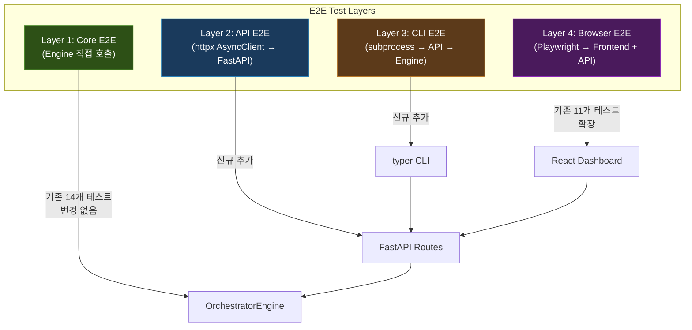
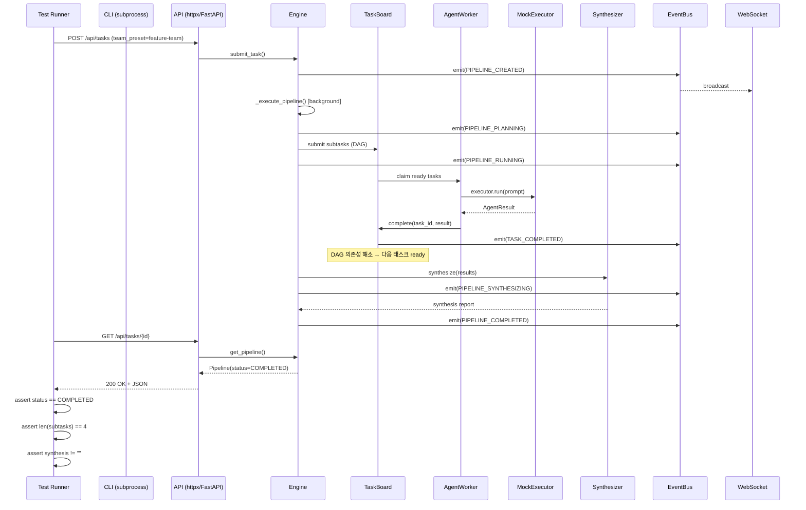
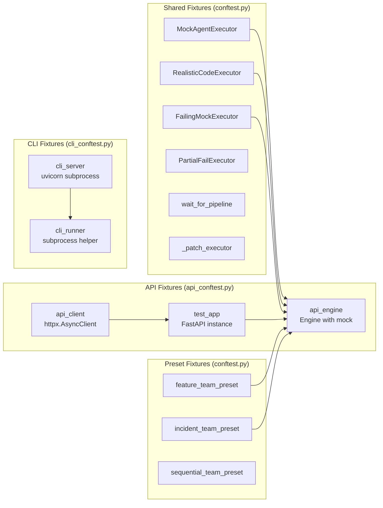
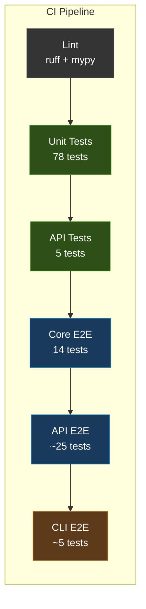

# E2E 테스트 아키텍처 설계서

> v1.0 | 2026-04-06
> 담당: 시니어 소프트웨어 아키텍트
> 대상: MVP Phase 6 (T6.1–T6.4) + Phase 7 CI 연동

---

## 1. 현황 분석 (As-Is)

### 1.1 기존 E2E 테스트 매트릭스

| 파일 | 시나리오 | 계층 | 테스트 수 |
|------|----------|------|-----------|
| `test_coding_scenario.py` | JWT 코딩 팀 (DAG) | Core only | 4 |
| `test_incident_scenario.py` | 인시던트 병렬 분석 | Core only | 3 |
| `test_failure_scenario.py` | 실패 + 폴백 + 재시도 | Core only | 4 |
| `test_resume_scenario.py` | 취소 + 재개 + 체크포인트 | Core only | 3 |
| `test_playwright_e2e.py` | API + 프론트엔드 접근 | API/UI | 11 |

### 1.2 커버리지 갭 분석

```
┌─────────────────────────────────────────────────────────────────┐
│                        E2E Coverage Gap                         │
├─────────────────────────────────────────────────────────────────┤
│                                                                 │
│  ✅ Core 계층 (Engine 직접 호출)                                 │
│     └─ submit → plan → execute → synthesize → complete          │
│                                                                 │
│  ✅ Playwright (API 엔드포인트 접근성)                            │
│     └─ health, presets, board, tasks 기본 CRUD                  │
│                                                                 │
│  ❌ API-through-Core (HTTP 요청 → Engine → 응답 round-trip)      │
│  ❌ WebSocket 실시간 이벤트 스트리밍                               │
│  ❌ CLI → API 전체 경로                                          │
│  ❌ 동시 파이프라인 (concurrent pipelines)                        │
│  ❌ 프리셋 생명주기 (create → use → verify)                      │
│  ❌ Worktree 격리 (git worktree + file diff)                    │
│  ❌ 에러 전파 (Core 에러 → API 응답 코드 → CLI 출력)              │
│  ❌ 성능 기준선 (baseline latency, throughput)                   │
│  ❌ 데이터 정합성 (Pipeline ↔ TaskBoard ↔ EventBus 일관성)       │
│                                                                 │
└─────────────────────────────────────────────────────────────────┘
```

### 1.3 기존 설계의 장점 (보존 대상)

1. **MockExecutor 패턴**: 실제 CLI 없이 전체 흐름 검증 — 이미 `RealisticCodeExecutor`, `FailingMockExecutor`, `PartialFailExecutor`로 잘 구성됨
2. **`_patch_executor` / `wait_for_pipeline` 헬퍼**: 간결한 테스트 setup
3. **fixture 기반 프리셋 주입**: `feature_team_preset`, `incident_team_preset` 재사용성 우수
4. **pytest mark (`@pytest.mark.e2e`)**: 기본 실행에서 분리 (`addopts = "-m 'not integration and not e2e'"`)

---

## 2. 설계 목표

### 2.1 핵심 원칙

| # | 원칙 | 근거 |
|---|------|------|
| P1 | **3-Layer 관통 검증** | Core만 테스트하면 API 직렬화, HTTP 상태 코드, WebSocket 이벤트 전달 등의 결함을 놓침 |
| P2 | **Mock Executor 유지** | 실제 CLI(Claude/Codex/Gemini)는 비결정적·고비용. E2E에서는 오케스트레이션 흐름만 검증 |
| P3 | **시나리오 기반 구조화** | 기능별 파일이 아닌 사용자 시나리오별 파일 구성으로 비즈니스 맥락 유지 |
| P4 | **CI 친화성** | 외부 서비스 의존 없음, 30초 이내 완료, 재현 가능 |
| P5 | **점진적 확장** | 기존 14개 Core E2E는 그대로 유지하면서 상위 계층 E2E를 추가 |

### 2.2 성공 기준 (SPEC.md §9 대응)

| SPEC 기준 | E2E 검증 방법 |
|-----------|--------------|
| ① 코딩: 분해→병렬 실행→merge→결과물 | `test_coding_scenario.py` + API round-trip 추가 |
| ② 인시던트: 다수 에이전트 병렬→종합 보고서 | `test_incident_scenario.py` + WebSocket 이벤트 검증 추가 |
| ③ 실패→폴백 작동 | `test_failure_scenario.py` + API 에러 응답 코드 검증 |
| ④ 중단 후 resume | `test_resume_scenario.py` + API resume 엔드포인트 검증 |
| ⑤ CLI와 웹 동일 동작 | **신규**: CLI subprocess E2E + API E2E 교차 검증 |
| ⑥ 프리셋으로 팀 변경 (코드 수정 없이) | **신규**: Preset lifecycle E2E |
| ⑦ 커스텀 에이전트 추가 (AgentExecutor 구현만으로) | **신규**: Custom executor E2E |

---

## 3. 아키텍처 설계

### 3.1 E2E 테스트 계층 구조



### 3.2 테스트 데이터 흐름



### 3.3 Fixture 아키텍처



---

## 4. 상세 시나리오 설계

### 4.1 Layer 2: API E2E 시나리오

#### 4.1.1 태스크 전체 생명주기 (Happy Path)

```
POST /api/tasks → 201 → task_id
  ↓ poll
GET /api/tasks/{id} → 200 → status: planning
  ↓ poll
GET /api/tasks/{id} → 200 → status: running
  ↓ poll
GET /api/tasks/{id} → 200 → status: completed
  ↓
GET /api/tasks/{id}/subtasks → 200 → 4 subtasks (all done)
  ↓
GET /api/artifacts/{id} → 200 → synthesis + outputs
```

#### 4.1.2 에러 전파 시나리오

```
POST /api/tasks (empty task) → 400 (validation error)
POST /api/tasks (bad preset) → 404 (preset not found)
DELETE /api/tasks/{id} → 204 (cancel running)
DELETE /api/tasks/{nonexist} → 404
POST /api/tasks/{id}/resume → 409 (not resumable)
```

#### 4.1.3 WebSocket 이벤트 스트리밍

```
WS /ws/events → connect
POST /api/tasks → submit
  ↓ ws messages
pipeline.created → pipeline.planning → pipeline.running
→ agent.executing (×N) → task.completed (×N)
→ pipeline.synthesizing → pipeline.completed
```

### 4.2 Layer 3: CLI E2E 시나리오

#### 4.2.1 CLI → API round-trip

```bash
# 1. 서버 시작 (fixture)
orchestrator serve --port 9999 &

# 2. 태스크 실행
orchestrator run "JWT 인증 구현" --team feature-team --api http://localhost:9999
# → exit 0, stdout에 pipeline 결과 포함

# 3. 상태 조회
orchestrator status {task_id} --api http://localhost:9999
# → exit 0, status=completed

# 4. 프리셋 조회
orchestrator presets list --api http://localhost:9999
# → exit 0, preset 목록 출력
```

### 4.3 Cross-cutting 시나리오

#### 4.3.1 동시 파이프라인

```
submit pipeline-A (feature-team, 4 subtasks)
submit pipeline-B (incident-team, 3 subtasks)
  ↓ 동시 실행
pipeline-A.subtasks 와 pipeline-B.subtasks 가 간섭 없이 완료
  ↓
각각의 synthesis 독립 생성
TaskBoard에 두 파이프라인의 태스크가 격리됨
```

#### 4.3.2 프리셋 생명주기

```
POST /api/presets/agents → custom-agent 생성
POST /api/presets/teams → custom-team 생성 (custom-agent 사용)
POST /api/tasks → custom-team으로 태스크 실행
  ↓
pipeline 완료 확인
custom-agent가 실제로 사용됐는지 검증
```

#### 4.3.3 데이터 정합성

```
submit_task() 후:
  Pipeline.subtasks.length == TaskBoard.tasks(pipeline_id).length
  Pipeline.results.length == completed TaskBoard tasks
  EventBus.history에 모든 상태 전이 이벤트 포함
  Pipeline.status와 TaskBoard 태스크 상태가 일관됨
```

---

## 5. 인터페이스 정의

### 5.1 API E2E 테스트 Fixture 인터페이스

```python
# tests/e2e/api_conftest.py

@pytest.fixture
async def api_engine(e2e_config: OrchestratorConfig) -> OrchestratorEngine:
    """API E2E용 Engine 인스턴스.

    MockExecutor가 주입된 상태로 생성된다.
    Engine 라이프사이클(start/shutdown)을 관리한다.
    """
    ...

@pytest.fixture
async def api_client(api_engine: OrchestratorEngine) -> AsyncGenerator[httpx.AsyncClient, None]:
    """httpx AsyncClient with FastAPI TestClient transport.

    실제 HTTP 서버 없이 ASGI 앱에 직접 요청한다.
    api_engine이 app.state.engine에 주입된 상태.
    """
    ...

@pytest.fixture
async def ws_client(api_engine: OrchestratorEngine) -> AsyncGenerator[WebSocketTestClient, None]:
    """WebSocket 테스트 클라이언트.

    /ws/events 엔드포인트에 연결하여 이벤트를 수신한다.
    """
    ...
```

### 5.2 CLI E2E 테스트 Fixture 인터페이스

```python
# tests/e2e/cli_conftest.py

@pytest.fixture(scope="module")
async def cli_server(e2e_config: OrchestratorConfig) -> AsyncGenerator[str, None]:
    """E2E 테스트용 API 서버 프로세스.

    uvicorn을 subprocess로 실행하고, health check 통과 후 yield.
    테스트 완료 후 프로세스 종료.

    Yields:
        base_url: str — "http://127.0.0.1:{port}"
    """
    ...

@pytest.fixture
def cli_runner(cli_server: str) -> CLIRunner:
    """CLI 명령어 실행 헬퍼.

    subprocess로 `orchestrator` CLI를 실행하고 결과를 캡처한다.
    --api 옵션을 자동으로 추가한다.
    """
    ...


class CLIRunner:
    """CLI subprocess 실행 + 결과 검증 헬퍼."""

    def __init__(self, base_url: str) -> None: ...

    async def run(
        self,
        *args: str,
        timeout: float = 30.0,
        expect_exit_code: int = 0,
    ) -> CLIResult:
        """CLI 명령어를 실행한다.

        Args:
            args: CLI 인자 (예: "run", "JWT 구현", "--team", "feature-team")
            timeout: 최대 대기 시간 (초)
            expect_exit_code: 기대 종료 코드

        Returns:
            CLIResult: stdout, stderr, exit_code를 포함하는 결과 객체
        """
        ...


@dataclass
class CLIResult:
    """CLI 실행 결과."""
    stdout: str
    stderr: str
    exit_code: int

    def assert_success(self) -> None: ...
    def assert_contains(self, text: str) -> None: ...
    def json(self) -> dict[str, Any]: ...
```

### 5.3 WebSocket 테스트 클라이언트 인터페이스

```python
# tests/e2e/ws_helpers.py

class WebSocketTestClient:
    """WebSocket 이벤트 수집 클라이언트."""

    def __init__(self, app: FastAPI) -> None: ...

    async def connect(self) -> None:
        """WebSocket 연결을 수립한다."""
        ...

    async def collect_events(
        self,
        *,
        max_events: int = 100,
        timeout: float = 10.0,
        until_type: EventType | None = None,
    ) -> list[dict[str, Any]]:
        """이벤트를 수집한다.

        Args:
            max_events: 최대 수집 수
            timeout: 최대 대기 시간
            until_type: 이 이벤트 유형이 도착하면 즉시 반환

        Returns:
            수집된 이벤트 딕셔너리 목록
        """
        ...

    async def disconnect(self) -> None:
        """WebSocket 연결을 종료한다."""
        ...
```

### 5.4 Pipeline Polling 헬퍼 인터페이스

```python
# tests/e2e/helpers.py

async def poll_pipeline_via_api(
    client: httpx.AsyncClient,
    task_id: str,
    *,
    terminal_statuses: set[str] | None = None,
    max_wait: float = 15.0,
    poll_interval: float = 0.2,
) -> dict[str, Any]:
    """API를 통해 파이프라인이 터미널 상태에 도달할 때까지 polling한다.

    Args:
        client: httpx AsyncClient
        task_id: 파이프라인 ID
        terminal_statuses: 터미널 상태 집합. None이면 기본값 사용.
        max_wait: 최대 대기 시간 (초)
        poll_interval: 폴링 간격 (초)

    Returns:
        최종 파이프라인 상태 딕셔너리

    Raises:
        TimeoutError: 시간 내 터미널 상태 미도달
    """
    ...


async def assert_pipeline_data_integrity(
    engine: OrchestratorEngine,
    task_id: str,
) -> None:
    """파이프라인 데이터 정합성을 검증한다.

    검증 항목:
    - Pipeline.subtasks 수 == TaskBoard 해당 pipeline 태스크 수
    - Pipeline.results 수 == 완료/실패된 TaskBoard 태스크 수
    - 모든 결과의 subtask_id가 Pipeline.subtasks에 존재
    - EventBus 히스토리에 CREATED→COMPLETED 이벤트 존재
    - Pipeline.status와 TaskBoard 태스크 상태 집합이 일관

    Raises:
        AssertionError: 정합성 위반 시
    """
    ...
```

### 5.5 Custom Executor E2E 인터페이스

```python
# tests/e2e/test_custom_executor_scenario.py

class CustomRestExecutor(AgentExecutor):
    """커스텀 AgentExecutor 구현 예제 (E2E 검증용).

    SPEC 성공기준 ⑦: AgentExecutor 구현만으로 커스텀 에이전트 추가 가능.
    REST API를 호출하는 mock executor로, 실제 추가 시나리오를 시뮬레이션한다.
    """

    executor_type: str = "custom-rest"

    def __init__(self, *, response_text: str = "Custom result") -> None: ...

    async def run(
        self,
        prompt: str,
        *,
        timeout: int = 300,
        context: dict[str, Any] | None = None,
    ) -> AgentResult: ...

    async def health_check(self) -> bool: ...
```

---

## 6. 파일 구조 및 역할

### 6.1 신규 생성 파일 목록

| 파일 경로 | 역할 | 의존 |
|-----------|------|------|
| `tests/e2e/helpers.py` | 공용 헬퍼: `poll_pipeline_via_api`, `assert_pipeline_data_integrity` | httpx, engine |
| `tests/e2e/ws_helpers.py` | WebSocket 테스트 클라이언트: `WebSocketTestClient` | fastapi, websockets |
| `tests/e2e/api_conftest.py` | API E2E fixture: `api_client`, `api_engine`, `ws_client` | httpx, FastAPI TestClient |
| `tests/e2e/cli_conftest.py` | CLI E2E fixture: `cli_server`, `cli_runner`, `CLIRunner`, `CLIResult` | subprocess, uvicorn |
| `tests/e2e/test_api_task_lifecycle.py` | API 태스크 전체 생명주기 E2E | api_conftest |
| `tests/e2e/test_api_error_propagation.py` | API 에러 전파 E2E (HTTP 상태 코드 검증) | api_conftest |
| `tests/e2e/test_api_websocket_events.py` | WebSocket 이벤트 스트리밍 E2E | ws_helpers, api_conftest |
| `tests/e2e/test_cli_round_trip.py` | CLI → API round-trip E2E | cli_conftest |
| `tests/e2e/test_concurrent_pipelines.py` | 동시 파이프라인 격리 E2E | api_conftest |
| `tests/e2e/test_preset_lifecycle.py` | 프리셋 생성 → 사용 → 검증 E2E | api_conftest |
| `tests/e2e/test_custom_executor_scenario.py` | 커스텀 executor 등록 + 실행 E2E | conftest |
| `tests/e2e/test_data_integrity.py` | Pipeline ↔ TaskBoard ↔ EventBus 정합성 E2E | helpers, conftest |

### 6.2 수정 대상 파일

| 파일 경로 | 변경 내용 |
|-----------|-----------|
| `tests/e2e/conftest.py` | `wait_for_pipeline` 개선 (timeout 메시지 강화), 공유 fixture 유지 |
| `pyproject.toml` | `e2e_api` marker 추가, playwright 의존성 dev 그룹 이동 |

### 6.3 기존 유지 파일 (변경 없음)

| 파일 경로 | 이유 |
|-----------|------|
| `tests/e2e/test_coding_scenario.py` | Core 계층 검증 완료 (4 tests) — Layer 1으로 보존 |
| `tests/e2e/test_incident_scenario.py` | Core 계층 검증 완료 (3 tests) — Layer 1으로 보존 |
| `tests/e2e/test_failure_scenario.py` | Core 계층 검증 완료 (4 tests) — Layer 1으로 보존 |
| `tests/e2e/test_resume_scenario.py` | Core 계층 검증 완료 (3 tests) — Layer 1으로 보존 |
| `tests/e2e/test_playwright_e2e.py` | Browser 계층 검증 (11 tests) — Layer 4로 보존 |

### 6.4 최종 디렉토리 구조

```
tests/e2e/
├── __init__.py                          # (기존)
├── conftest.py                          # (기존) Mock executors + 공유 fixture
├── helpers.py                           # (신규) poll_pipeline_via_api, assert_data_integrity
├── ws_helpers.py                        # (신규) WebSocketTestClient
├── api_conftest.py                      # (신규) API E2E fixture
├── cli_conftest.py                      # (신규) CLI E2E fixture
│
├── # ── Layer 1: Core E2E (기존, 변경 없음) ──
├── test_coding_scenario.py              # JWT 코딩 팀 DAG
├── test_incident_scenario.py            # 인시던트 병렬 분석
├── test_failure_scenario.py             # 실패 + 폴백
├── test_resume_scenario.py              # 취소 + 재개
│
├── # ── Layer 2: API E2E (신규) ──
├── test_api_task_lifecycle.py           # 태스크 전체 생명주기
├── test_api_error_propagation.py        # 에러 전파 + HTTP 상태 코드
├── test_api_websocket_events.py         # WebSocket 이벤트 스트리밍
├── test_concurrent_pipelines.py         # 동시 파이프라인 격리
├── test_preset_lifecycle.py             # 프리셋 CRUD + 사용
│
├── # ── Layer 3: CLI E2E (신규) ──
├── test_cli_round_trip.py               # CLI → API round-trip
│
├── # ── Layer 4: Browser E2E (기존) ──
├── test_playwright_e2e.py               # Playwright API + 프론트엔드
│
└── # ── Cross-cutting (신규) ──
    ├── test_custom_executor_scenario.py  # 커스텀 executor 확장성
    └── test_data_integrity.py           # 데이터 정합성
```

---

## 7. 주요 테스트 케이스 목록

### 7.1 API 태스크 생명주기 (`test_api_task_lifecycle.py`)

| # | 테스트 | 검증 |
|---|--------|------|
| 1 | `test_submit_and_complete_coding_task` | POST → polling → COMPLETED, subtasks=4, synthesis≠"" |
| 2 | `test_submit_and_complete_incident_task` | POST → COMPLETED, 3개 병렬 결과 |
| 3 | `test_submit_task_returns_201_with_task_id` | 응답 구조: task_id, status=pending |
| 4 | `test_list_tasks_includes_submitted` | POST 후 GET /tasks에 포함 |
| 5 | `test_get_task_detail_includes_subtasks` | GET /tasks/{id}/subtasks → 서브태스크 상세 |
| 6 | `test_get_task_files_after_completion` | GET /tasks/{id}/files → 파일 변경 목록 |
| 7 | `test_cancel_running_task_returns_204` | DELETE /tasks/{id} → 204, status=cancelled |
| 8 | `test_resume_failed_task_returns_200` | POST /tasks/{id}/resume → 200, status=running |

### 7.2 API 에러 전파 (`test_api_error_propagation.py`)

| # | 테스트 | 검증 |
|---|--------|------|
| 1 | `test_submit_empty_task_returns_400` | POST(task="") → 400 |
| 2 | `test_submit_nonexistent_preset_returns_404` | POST(team_preset="xxx") → 404 |
| 3 | `test_get_nonexistent_task_returns_404` | GET /tasks/xxx → 404 |
| 4 | `test_resume_completed_task_returns_409` | POST /tasks/{completed}/resume → 409 |
| 5 | `test_cancel_completed_task_returns_404` | DELETE /tasks/{completed} → 404 |
| 6 | `test_all_fail_pipeline_shows_failed_via_api` | 모든 executor 실패 → GET → status=failed |
| 7 | `test_partial_fail_pipeline_status_via_api` | 일부 실패 → status=partial_failure |

### 7.3 WebSocket 이벤트 (`test_api_websocket_events.py`)

| # | 테스트 | 검증 |
|---|--------|------|
| 1 | `test_ws_receives_pipeline_lifecycle_events` | CREATED→PLANNING→RUNNING→SYNTHESIZING→COMPLETED 순서 |
| 2 | `test_ws_receives_agent_execution_events` | AGENT_EXECUTING 이벤트 N개 수신 |
| 3 | `test_ws_receives_task_completion_events` | TASK_COMPLETED 이벤트 task_id 매칭 |
| 4 | `test_ws_filters_by_task_id` | 특정 pipeline의 이벤트만 수신 (향후 필터링 지원 시) |

### 7.4 CLI Round-trip (`test_cli_round_trip.py`)

| # | 테스트 | 검증 |
|---|--------|------|
| 1 | `test_cli_run_completes_task` | `orchestrator run` → exit 0 |
| 2 | `test_cli_status_shows_completed` | `orchestrator status {id}` → "completed" 출력 |
| 3 | `test_cli_presets_list` | `orchestrator presets list` → preset 목록 출력 |
| 4 | `test_cli_serve_and_health` | `orchestrator serve` → health check 통과 |
| 5 | `test_cli_invalid_command_returns_nonzero` | 잘못된 명령 → exit ≠ 0 |

### 7.5 동시 파이프라인 (`test_concurrent_pipelines.py`)

| # | 테스트 | 검증 |
|---|--------|------|
| 1 | `test_two_pipelines_run_concurrently` | 동시 submit → 각각 COMPLETED |
| 2 | `test_concurrent_pipelines_board_isolation` | TaskBoard에서 pipeline_id로 격리 |
| 3 | `test_concurrent_pipelines_events_isolated` | 이벤트가 각 task_id로 분리 |

### 7.6 프리셋 생명주기 (`test_preset_lifecycle.py`)

| # | 테스트 | 검증 |
|---|--------|------|
| 1 | `test_create_agent_preset_via_api` | POST → 201, GET → 조회 성공 |
| 2 | `test_create_team_preset_via_api` | POST → 201, agents/tasks 포함 |
| 3 | `test_use_custom_preset_in_pipeline` | 커스텀 팀으로 태스크 실행 → 완료 |
| 4 | `test_duplicate_preset_returns_409` | 동일 이름 재생성 → 409 |

### 7.7 커스텀 Executor (`test_custom_executor_scenario.py`)

| # | 테스트 | 검증 |
|---|--------|------|
| 1 | `test_custom_executor_runs_in_pipeline` | CustomRestExecutor 주입 → 파이프라인 완료 |
| 2 | `test_custom_executor_result_in_synthesis` | 커스텀 결과가 종합 보고서에 반영 |

### 7.8 데이터 정합성 (`test_data_integrity.py`)

| # | 테스트 | 검증 |
|---|--------|------|
| 1 | `test_pipeline_subtask_board_consistency` | Pipeline.subtasks == Board tasks 수 |
| 2 | `test_pipeline_results_match_completed_tasks` | results 수 == done tasks 수 |
| 3 | `test_event_history_contains_full_lifecycle` | 이벤트 히스토리 완전성 |
| 4 | `test_pipeline_status_reflects_board_state` | 상태 일관성 |

---

## 8. 실행 전략

### 8.1 pytest marker 구성

```toml
# pyproject.toml 추가/수정
[tool.pytest.ini_options]
markers = [
    "e2e: 전체 파이프라인 E2E 테스트 (Core 직접 호출)",
    "e2e_api: API 계층 E2E 테스트 (httpx → FastAPI)",
    "e2e_cli: CLI 계층 E2E 테스트 (subprocess → API)",
    "e2e_browser: 브라우저 E2E 테스트 (Playwright)",
    "slow: 실행 시간이 긴 테스트",
]
addopts = "-m 'not integration and not e2e and not e2e_api and not e2e_cli and not e2e_browser' --timeout=30"
```

### 8.2 실행 명령어

```bash
# Layer 1: Core E2E (기존)
uv run pytest tests/e2e/ -m e2e -v --timeout=60

# Layer 2: API E2E (신규)
uv run pytest tests/e2e/ -m e2e_api -v --timeout=60

# Layer 3: CLI E2E (신규)
uv run pytest tests/e2e/ -m e2e_cli -v --timeout=120

# Layer 4: Browser E2E (기존)
uv run pytest tests/e2e/test_playwright_e2e.py -v --timeout=60

# 전체 E2E
uv run pytest tests/e2e/ -m 'e2e or e2e_api or e2e_cli' -v --timeout=120

# CI에서 전체 E2E (브라우저 제외)
uv run pytest tests/e2e/ -m 'e2e or e2e_api' -v --timeout=120
```

### 8.3 CI 파이프라인 통합



---

## 9. Trade-off 분석

### 9.1 httpx TestClient vs 실 서버

| 관점 | httpx TestClient (ASGI) | 실 uvicorn 서버 |
|------|------------------------|----------------|
| **속도** | ✅ 빠름 (in-process) | ❌ 서버 startup 지연 |
| **격리** | ✅ 각 테스트마다 독립 앱 | ❌ 포트 충돌 가능 |
| **현실성** | ❌ 실제 네트워크 미통과 | ✅ 실 HTTP 통신 |
| **디버깅** | ✅ 동일 프로세스 breakpoint | ❌ 별도 프로세스 |

**결정**: Layer 2는 **httpx AsyncClient + ASGI transport** 사용. Layer 3 (CLI)에서만 실 서버 기동.

**근거**: API E2E의 핵심 목표는 "HTTP 요청 → Engine → 응답" 경로 검증이지 네트워크 스택 검증이 아님. TestClient로 충분하며, CI 시간을 50% 이상 절감.

### 9.2 conftest 분리 전략

| 관점 | 단일 conftest.py | 계층별 분리 (api_conftest, cli_conftest) |
|------|-----------------|---------------------------------------|
| **단순성** | ✅ 한 파일에서 모든 fixture | ❌ 파일 수 증가 |
| **의존성 관리** | ❌ 불필요한 import 로딩 | ✅ 필요한 것만 로딩 |
| **충돌 방지** | ❌ fixture 이름 충돌 위험 | ✅ 네임스페이스 분리 |

**결정**: **계층별 분리**. `conftest.py` (공유) + `api_conftest.py` (API) + `cli_conftest.py` (CLI).

**근거**: `conftest.py`는 pytest가 자동 발견하지만, `api_conftest.py`/`cli_conftest.py`는 `conftest_` prefix로 명시적 import. Layer 2 테스트에서만 httpx/FastAPI fixture를 로딩하고, Layer 3에서만 subprocess fixture를 로딩.

> **구현 참고**: pytest는 `conftest.py`만 자동 로딩하므로, `api_conftest.py`의 fixture는 각 테스트 파일에서 `pytest_plugins = ["tests.e2e.api_conftest"]` 또는 `from tests.e2e.api_conftest import *` 방식으로 사용한다. 또는 `conftest.py`에서 조건부 import하는 방식을 채택할 수 있다.

### 9.3 WebSocket 테스트 전략

| 관점 | Starlette TestClient WS | 직접 websockets 라이브러리 |
|------|------------------------|--------------------------|
| **통합성** | ✅ TestClient에 내장 | ❌ 별도 연결 관리 |
| **비동기 지원** | ⚠️ sync context에서 실행 | ✅ 완전한 async |
| **유지보수** | ✅ httpx와 동일 패턴 | ❌ 별도 패턴 |

**결정**: **httpx + Starlette WebSocketTestSession** 사용.

**근거**: FastAPI의 TestClient가 WebSocket 테스트를 기본 지원하므로 별도 라이브러리 불필요. `starlette.testclient.TestClient`의 `websocket_connect()` 활용.

### 9.4 기존 Core E2E 수정 여부

| 관점 | 기존 테스트 수정 | 기존 유지 + 상위 계층 추가 |
|------|----------------|-------------------------|
| **리스크** | ❌ 기존 테스트 깨질 위험 | ✅ 안전 |
| **중복** | ✅ 중복 제거 | ❌ 일부 중복 (Core + API에서 같은 시나리오) |
| **비용** | ❌ 기존 14개 리팩토링 | ✅ 신규만 개발 |

**결정**: **기존 유지 + 상위 계층 추가** (P5 원칙).

**근거**: Core E2E와 API E2E는 검증 관점이 다름. Core E2E는 Engine 내부 상태 전이를 직접 검증하고, API E2E는 HTTP 직렬화/역직렬화 + 상태 코드를 검증. 테스트 피라미드 관점에서 두 계층 모두 필요.

---

## 10. 구현 우선순위

### Phase 1: 인프라 (1일)

1. `tests/e2e/helpers.py` — 공용 헬퍼 구현
2. `tests/e2e/api_conftest.py` — API fixture 구현
3. `pyproject.toml` — marker 추가

### Phase 2: API E2E Core (2일)

4. `tests/e2e/test_api_task_lifecycle.py` — 8 tests
5. `tests/e2e/test_api_error_propagation.py` — 7 tests
6. `tests/e2e/test_data_integrity.py` — 4 tests

### Phase 3: 이벤트 + 동시성 (1일)

7. `tests/e2e/ws_helpers.py` — WebSocket 클라이언트
8. `tests/e2e/test_api_websocket_events.py` — 4 tests
9. `tests/e2e/test_concurrent_pipelines.py` — 3 tests

### Phase 4: 프리셋 + 확장성 (1일)

10. `tests/e2e/test_preset_lifecycle.py` — 4 tests
11. `tests/e2e/test_custom_executor_scenario.py` — 2 tests

### Phase 5: CLI E2E (1일)

12. `tests/e2e/cli_conftest.py` — CLI fixture
13. `tests/e2e/test_cli_round_trip.py` — 5 tests

### 총계

| 구분 | 테스트 수 |
|------|-----------|
| 기존 Core E2E (변경 없음) | 14 |
| 기존 Playwright (변경 없음) | 11 |
| **신규 API E2E** | **~26** |
| **신규 CLI E2E** | **~5** |
| **신규 Cross-cutting** | **~6** |
| **E2E 총계** | **~62** |

---

## 11. 리스크 및 완화 전략

| 리스크 | 영향 | 완화 |
|--------|------|------|
| API E2E에서 비동기 타이밍 이슈 | 간헐적 실패 (flaky test) | `poll_pipeline_via_api`에 exponential backoff 적용, `max_wait` 여유 있게 설정 |
| CLI subprocess 포트 충돌 | CI에서 실패 | `cli_server` fixture에서 랜덤 포트 사용 (`port=0`) |
| WebSocket 이벤트 순서 비결정적 | 순서 검증 실패 | 순서 검증은 "필수 이벤트 존재" + "상대적 순서"만 체크 (절대 순서 X) |
| Mock executor와 실제 executor 동작 차이 | 프로덕션 버그 미검출 | E2E는 "오케스트레이션 흐름" 검증 목적. 실 CLI 테스트는 `@pytest.mark.integration`으로 분리 |

---

## 부록 A: Marker Decorator 사용 예시

```python
# tests/e2e/test_api_task_lifecycle.py

import pytest
from tests.e2e.api_conftest import api_client, api_engine  # fixture import

pytestmark = pytest.mark.e2e_api


async def test_submit_and_complete_coding_task(api_client, api_engine):
    """POST /api/tasks → polling → COMPLETED."""
    from tests.e2e.conftest import RealisticCodeExecutor, _patch_executor
    from tests.e2e.helpers import poll_pipeline_via_api

    _patch_executor(api_engine, RealisticCodeExecutor())

    # Submit
    resp = await api_client.post("/api/tasks", json={
        "task": "JWT 인증 미들웨어 구현",
        "team_preset": "feature-team",
    })
    assert resp.status_code == 201
    task_id = resp.json()["task_id"]

    # Poll until completed
    final = await poll_pipeline_via_api(api_client, task_id)
    assert final["status"] == "completed"
    assert len(final["subtasks"]) == 4
    assert final["synthesis"] != ""
```

---

> **이 문서는 설계 지침이며, 구현 코드는 포함하지 않습니다.**
> 각 파일의 상세 구현은 이 설계에 기반하여 구현 담당자가 진행합니다.
