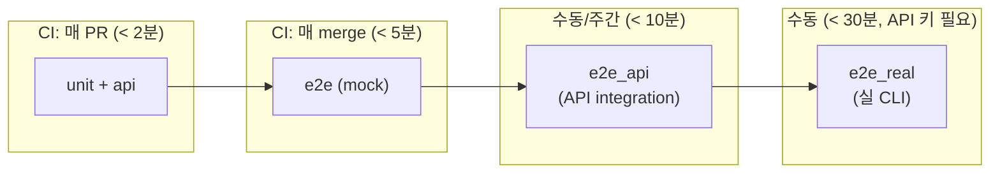
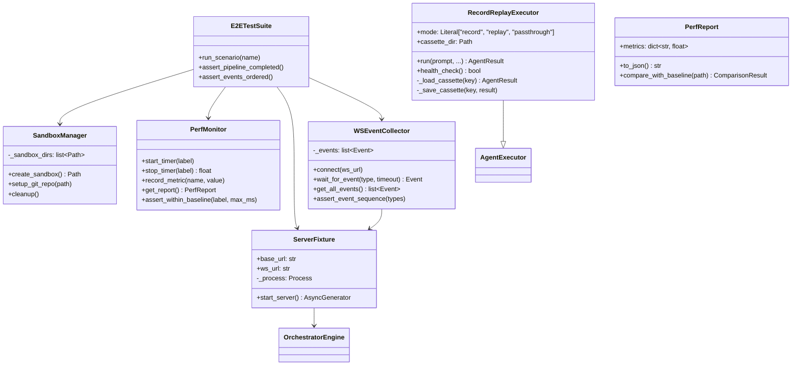
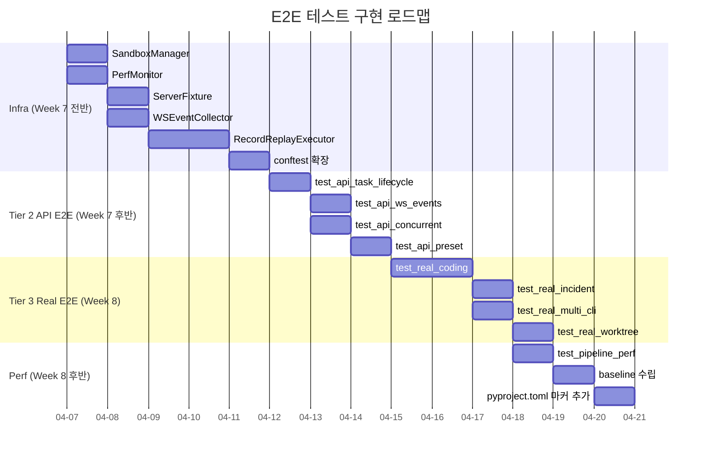

# E2E 테스트 아키텍처 설계서

> v1.0 | 2026-04-06
> 대상 Phase: MVP Phase 6 (Week 7-8) — 실 에이전트 E2E
> 기반: SPEC.md v2.0, MVP-PLAN.md, 기존 E2E tests 분석

---

## 1. 현황 분석 및 설계 동기

### 1.1 기존 E2E 테스트 현황

| 파일 | 시나리오 | 실행 방식 | 한계 |
|------|---------|----------|------|
| `test_coding_scenario.py` | JWT 코딩팀 DAG | MockExecutor | 실 CLI 미검증 |
| `test_incident_scenario.py` | 인시던트 분석 병렬 | MockExecutor | 실 MCP 미검증 |
| `test_failure_scenario.py` | 실패/폴백/부분실패 | FailingMockExecutor | 실 에러 패턴 미검증 |
| `test_resume_scenario.py` | 중단/재개/체크포인트 | MockExecutor + 수동 상태조작 | 실 체크포인트 복원 미검증 |
| `test_playwright_e2e.py` | API + 프론트엔드 | Playwright (서버 수동) | 자동 서버 기동 미지원 |

**핵심 Gap**: 모든 테스트가 `MockAgentExecutor`에 의존하여, **실 CLI 프로세스 호출**, **API 서버 통합**, **WebSocket 실시간 이벤트**, **성능 측정** 영역이 공백이다.

### 1.2 설계 목표

1. **실 CLI E2E 레이어 추가** — 실제 `claude`/`codex`/`gemini` CLI를 호출하는 E2E 시나리오
2. **API Integration E2E** — `httpx.AsyncClient`로 API 서버 경유 전체 흐름 검증
3. **WebSocket E2E** — 실시간 이벤트 스트림 수신 및 순서/완결성 검증
4. **Performance Baseline** — 핵심 파이프라인의 latency/throughput 기준선 수립
5. **Deterministic Replay** — 실 CLI 결과를 기록(record)하고 재생(replay)하는 테스트 인프라

---

## 2. 아키텍처 설계

### 2.1 E2E 테스트 3-Tier 구조

```mermaid
graph TB
    subgraph "Tier 1: Mock E2E (기존)"
        T1A[test_coding_scenario]
        T1B[test_incident_scenario]
        T1C[test_failure_scenario]
        T1D[test_resume_scenario]
    end

    subgraph "Tier 2: API Integration E2E (신규)"
        T2A[test_api_task_lifecycle]
        T2B[test_api_ws_events]
        T2C[test_api_concurrent_tasks]
        T2D[test_api_preset_workflow]
    end

    subgraph "Tier 3: Real CLI E2E (신규)"
        T3A[test_real_coding_pipeline]
        T3B[test_real_incident_mcp]
        T3C[test_real_multi_cli]
        T3D[test_real_worktree_merge]
    end

    subgraph "Shared Infra"
        FX[E2E Fixtures]
        RC[RecordReplayExecutor]
        PM[PerfMonitor]
        SB[SandboxManager]
    end

    T1A --> FX
    T2A --> FX
    T2A --> SB
    T3A --> FX
    T3A --> RC
    T3A --> PM
    T3A --> SB
```



### 2.2 테스트 실행 계층 및 마커 전략



| 마커 | 대상 | API 키 | CI | 타임아웃 | 비고 |
|------|------|--------|-----|---------|------|
| `@pytest.mark.e2e` | Tier 1 (기존 mock) | 불필요 | merge 후 | 30초 | 기존 유지 |
| `@pytest.mark.e2e_api` | Tier 2 (API 통합) | 불필요 | 주간 | 60초 | 서버 자동기동 |
| `@pytest.mark.e2e_real` | Tier 3 (실 CLI) | **필요** | 수동 | 300초 | 비용 발생 |
| `@pytest.mark.perf` | 성능 벤치마크 | 선택 | 수동 | 120초 | baseline 비교 |

### 2.3 컴포넌트 의존 관계



---

## 3. 핵심 인터페이스 정의

### 3.1 `SandboxManager` — E2E 격리 환경

```python
"""tests/e2e/infra/sandbox.py — E2E 테스트 격리 샌드박스 관리."""

from __future__ import annotations

from pathlib import Path
from typing import AsyncGenerator


class SandboxManager:
    """E2E 테스트용 격리된 파일시스템 + git 리포지토리 관리.

    각 테스트마다 독립된 디렉토리를 생성하고,
    git 초기화, fixture 파일 배치, 테스트 후 정리를 담당한다.

    Trade-off:
    - tempfile.mkdtemp vs fixtures 복사 — tempfile이 빠르지만
      fixture 파일이 필요한 테스트에서는 복사 방식 사용
    - 디렉토리별 격리 vs worktree 격리 — worktree는 git 의존,
      디렉토리별 격리가 더 범용적
    """

    def __init__(self, base_dir: Path | None = None) -> None:
        """
        Args:
            base_dir: 샌드박스 루트 디렉토리. None이면 시스템 tmp 사용.
        """
        ...

    async def create_sandbox(
        self,
        *,
        with_git: bool = True,
        fixture_dir: Path | None = None,
    ) -> Path:
        """새 샌드박스를 생성한다.

        Args:
            with_git: git 초기화 여부. True면 git init + initial commit.
            fixture_dir: 복사할 fixture 디렉토리. None이면 빈 리포지토리.

        Returns:
            생성된 샌드박스 디렉토리 경로.
        """
        ...

    async def cleanup(self) -> None:
        """모든 샌드박스 디렉토리를 삭제한다."""
        ...

    async def cleanup_one(self, path: Path) -> None:
        """특정 샌드박스를 삭제한다."""
        ...
```

### 3.2 `RecordReplayExecutor` — 실 CLI 결과 기록/재생

```python
"""tests/e2e/infra/record_replay.py — 실 CLI 호출 기록/재생 executor."""

from __future__ import annotations

import hashlib
import json
from pathlib import Path
from typing import Any, Literal

from orchestrator.core.executor.base import AgentExecutor
from orchestrator.core.models.schemas import AgentResult


class RecordReplayExecutor(AgentExecutor):
    """실 CLI 호출을 기록(record)하거나 재생(replay)하는 AgentExecutor.

    VCR(Video Cassette Recorder) 패턴:
    - record 모드: 실 executor를 호출하고 결과를 cassette 파일에 저장
    - replay 모드: cassette에서 결과를 로드하여 CLI 호출 없이 반환
    - passthrough 모드: 기록 없이 실 executor 직접 호출

    Trade-off:
    - record/replay 방식:
      장점 — 결정론적, 비용 절감, CI 안정성
      단점 — cassette 파일 관리 부담, 실제 동작 변경 시 재기록 필요
    - cassette key 전략: prompt hash vs sequential ID
      → prompt hash 채택 (동일 입력 → 동일 출력 보장)
    """

    executor_type: str = "record_replay"

    def __init__(
        self,
        *,
        real_executor: AgentExecutor,
        cassette_dir: Path,
        mode: Literal["record", "replay", "passthrough"] = "replay",
        strict_replay: bool = True,
    ) -> None:
        """
        Args:
            real_executor: 실제 CLI executor (record/passthrough 모드에서 사용).
            cassette_dir: cassette 파일 저장 디렉토리.
            mode: 동작 모드.
            strict_replay: replay 모드에서 cassette 미존재 시 에러 발생 여부.
                           False면 fallback으로 real_executor 호출.
        """
        ...

    async def run(
        self,
        prompt: str,
        *,
        timeout: int = 300,
        context: dict[str, Any] | None = None,
    ) -> AgentResult:
        """프롬프트를 실행하고 결과를 반환한다.

        record: real_executor 호출 → cassette 저장 → 결과 반환
        replay: cassette 로드 → 결과 반환
        passthrough: real_executor 직접 호출 → 결과 반환
        """
        ...

    async def health_check(self) -> bool:
        """replay 모드에서는 항상 True, 그 외는 real_executor 위임."""
        ...

    def _cassette_key(self, prompt: str) -> str:
        """prompt에서 cassette 파일명을 생성한다.

        sha256(prompt)[:16] — 충돌 가능성 극히 낮으면서 파일명 길이 제한.
        """
        ...

    def _load_cassette(self, key: str) -> AgentResult | None:
        """cassette 파일에서 AgentResult를 로드한다."""
        ...

    def _save_cassette(self, key: str, result: AgentResult) -> None:
        """AgentResult를 cassette 파일에 저장한다."""
        ...
```

### 3.3 `PerfMonitor` — 성능 계측 및 baseline 비교

```python
"""tests/e2e/infra/perf.py — E2E 성능 계측 및 baseline 비교."""

from __future__ import annotations

import time
from dataclasses import dataclass, field
from pathlib import Path
from typing import Any


@dataclass
class PerfMetric:
    """개별 성능 측정값."""

    label: str
    value_ms: float
    timestamp: float = field(default_factory=time.time)
    metadata: dict[str, Any] = field(default_factory=dict)


@dataclass
class PerfReport:
    """성능 측정 보고서."""

    metrics: list[PerfMetric] = field(default_factory=list)
    test_name: str = ""

    def to_json(self) -> str:
        """JSON 직렬화."""
        ...

    def compare_with_baseline(
        self,
        baseline_path: Path,
        *,
        tolerance_pct: float = 20.0,
    ) -> dict[str, Any]:
        """baseline과 비교하여 회귀를 감지한다.

        Args:
            baseline_path: baseline JSON 파일 경로.
            tolerance_pct: 허용 오차 (%). 초과 시 회귀로 판정.

        Returns:
            비교 결과. {"regressions": [...], "improvements": [...], "unchanged": [...]}
        """
        ...


class PerfMonitor:
    """E2E 테스트 성능 계측기.

    컨텍스트 매니저 또는 수동 start/stop으로 구간 측정.
    테스트 종료 후 PerfReport를 생성하여 baseline과 비교할 수 있다.

    Trade-off:
    - time.monotonic vs time.perf_counter — 벽시계 안정성 vs 정밀도
      → monotonic 채택 (E2E 스케일에서 ns 정밀도 불필요)
    - 인메모리 수집 vs 파일 스트리밍 — 인메모리가 단순, E2E 메트릭 수 적음
    """

    def __init__(self, test_name: str = "") -> None:
        ...

    def start_timer(self, label: str) -> None:
        """구간 측정을 시작한다."""
        ...

    def stop_timer(self, label: str) -> float:
        """구간 측정을 종료하고 소요 시간(ms)을 반환한다."""
        ...

    def record_metric(
        self,
        label: str,
        value_ms: float,
        **metadata: Any,
    ) -> None:
        """수동으로 메트릭을 기록한다."""
        ...

    def get_report(self) -> PerfReport:
        """현재까지 수집된 메트릭으로 보고서를 생성한다."""
        ...

    def assert_within_baseline(
        self,
        label: str,
        max_ms: float,
        *,
        message: str = "",
    ) -> None:
        """특정 구간이 기대 범위 내인지 검증한다.

        Args:
            label: 측정 라벨.
            max_ms: 최대 허용 시간(ms).
            message: 실패 시 메시지.

        Raises:
            AssertionError: max_ms 초과 시.
        """
        ...
```

### 3.4 `ServerFixture` — 테스트용 API 서버 자동 기동

```python
"""tests/e2e/infra/server.py — E2E 테스트용 API 서버 fixture."""

from __future__ import annotations

import asyncio
from typing import AsyncGenerator

from orchestrator.core.config.schema import OrchestratorConfig
from orchestrator.core.engine import OrchestratorEngine


class ServerFixture:
    """E2E 테스트용 FastAPI 서버를 in-process로 기동/종료한다.

    uvicorn을 별도 프로세스가 아닌 asyncio task로 실행하여
    테스트 격리를 보장하고 포트 충돌을 방지한다.

    Trade-off:
    - subprocess vs in-process uvicorn:
      subprocess — 완벽한 격리, 하지만 startup/shutdown 느림
      in-process — 빠르고 엔진 직접 주입 가능, 메모리 공유
      → in-process 채택 (E2E에서 속도 + 엔진 제어 우선)
    - 포트 할당: 동적 포트(0)로 충돌 방지
    """

    def __init__(
        self,
        config: OrchestratorConfig | None = None,
        *,
        host: str = "127.0.0.1",
        port: int = 0,
    ) -> None:
        """
        Args:
            config: 서버 설정. None이면 테스트 기본값.
            host: 바인딩 주소.
            port: 포트. 0이면 동적 할당.
        """
        ...

    @property
    def base_url(self) -> str:
        """HTTP 베이스 URL (예: http://127.0.0.1:9123)."""
        ...

    @property
    def ws_url(self) -> str:
        """WebSocket URL (예: ws://127.0.0.1:9123/ws)."""
        ...

    @property
    def engine(self) -> OrchestratorEngine:
        """실행 중인 엔진 인스턴스에 직접 접근 (mock 주입용)."""
        ...

    async def start(self) -> None:
        """서버를 시작한다. 포트가 열릴 때까지 대기."""
        ...

    async def stop(self) -> None:
        """서버를 종료한다."""
        ...
```

### 3.5 `WSEventCollector` — WebSocket 이벤트 수집/검증

```python
"""tests/e2e/infra/ws_collector.py — WebSocket 이벤트 수집기."""

from __future__ import annotations

import asyncio
import json
from typing import Any

from orchestrator.core.events.types import EventType


class WSEventCollector:
    """WebSocket으로 이벤트를 수집하고 순서/완결성을 검증한다.

    Trade-off:
    - websockets 라이브러리 vs httpx-ws:
      websockets — 성숙, 안정, 단독 의존성
      httpx-ws — httpx와 통합, 하지만 WebSocket 기능 제한
      → websockets 채택 (WebSocket 전용 기능 필요)
    """

    def __init__(self, ws_url: str) -> None:
        """
        Args:
            ws_url: WebSocket 엔드포인트 URL.
        """
        ...

    async def connect(self, *, timeout: float = 5.0) -> None:
        """WebSocket에 연결한다."""
        ...

    async def disconnect(self) -> None:
        """연결을 종료한다."""
        ...

    async def wait_for_event(
        self,
        event_type: EventType | str,
        *,
        task_id: str | None = None,
        timeout: float = 30.0,
    ) -> dict[str, Any]:
        """특정 이벤트가 수신될 때까지 대기한다.

        Args:
            event_type: 대기할 이벤트 유형.
            task_id: 특정 파이프라인의 이벤트만 필터링.
            timeout: 최대 대기 시간(초).

        Returns:
            수신된 이벤트 딕셔너리.

        Raises:
            TimeoutError: timeout 초과 시.
        """
        ...

    def get_all_events(
        self,
        *,
        task_id: str | None = None,
    ) -> list[dict[str, Any]]:
        """수집된 전체 이벤트를 반환한다.

        Args:
            task_id: 필터링할 파이프라인 ID. None이면 전체.
        """
        ...

    def assert_event_sequence(
        self,
        expected_types: list[EventType | str],
        *,
        task_id: str | None = None,
        strict: bool = False,
    ) -> None:
        """이벤트 순서를 검증한다.

        Args:
            expected_types: 기대하는 이벤트 유형 순서.
            task_id: 필터링할 파이프라인 ID.
            strict: True면 정확한 순서 일치, False면 부분 순서(subsequence) 검증.

        Raises:
            AssertionError: 순서가 기대와 불일치 시.
        """
        ...
```

---

## 4. 테스트 시나리오 설계

### 4.1 Tier 2 — API Integration E2E

#### 4.1.1 태스크 전체 생명주기 (test_api_task_lifecycle.py)

```python
"""tests/e2e/api/test_api_task_lifecycle.py

API 서버를 통한 태스크 전체 생명주기 E2E 검증.
ServerFixture로 서버를 자동 기동하고, httpx로 API 호출.

검증 포인트:
  1. POST /api/tasks → 201, task_id 반환
  2. GET /api/tasks/{id} → pipeline status 변화 추적
  3. GET /api/tasks/{id}/subtasks → 서브태스크 상태
  4. GET /api/tasks/{id} → COMPLETED + synthesis
  5. DELETE /api/tasks/{id} → 취소 + 204
  6. POST /api/tasks/{id}/resume → 재개 + 200
"""

# 인터페이스만 정의 — 구현은 별도 태스크

async def test_submit_and_complete_via_api(
    api_server: ServerFixture,
    api_client: httpx.AsyncClient,
) -> None:
    """태스크 제출 → 완료까지 API만으로 추적."""
    ...


async def test_submit_with_invalid_preset_returns_404(
    api_server: ServerFixture,
    api_client: httpx.AsyncClient,
) -> None:
    """존재하지 않는 team_preset → 404."""
    ...


async def test_cancel_running_task_via_api(
    api_server: ServerFixture,
    api_client: httpx.AsyncClient,
) -> None:
    """실행 중인 태스크 취소 → 204 → status=cancelled."""
    ...


async def test_resume_failed_task_via_api(
    api_server: ServerFixture,
    api_client: httpx.AsyncClient,
) -> None:
    """실패한 태스크 재개 → 200 → 완료."""
    ...


async def test_list_tasks_with_pagination(
    api_server: ServerFixture,
    api_client: httpx.AsyncClient,
) -> None:
    """여러 태스크 제출 후 pagination 검증."""
    ...


async def test_subtask_detail_with_result(
    api_server: ServerFixture,
    api_client: httpx.AsyncClient,
) -> None:
    """완료된 서브태스크의 상세 결과 조회."""
    ...
```

#### 4.1.2 WebSocket 이벤트 스트리밍 (test_api_ws_events.py)

```python
"""tests/e2e/api/test_api_ws_events.py

WebSocket을 통한 실시간 이벤트 수신 및 순서 검증.

검증 포인트:
  1. WS 연결 → 태스크 제출 → 이벤트 스트림 수신
  2. 이벤트 순서: created → planning → running → synthesizing → completed
  3. 각 서브태스크의 executing/completed 이벤트
  4. 다중 클라이언트 동시 수신
"""

async def test_ws_receives_pipeline_lifecycle_events(
    api_server: ServerFixture,
    ws_collector: WSEventCollector,
    api_client: httpx.AsyncClient,
) -> None:
    """파이프라인 생명주기 이벤트를 WebSocket으로 수신."""
    ...


async def test_ws_receives_subtask_events(
    api_server: ServerFixture,
    ws_collector: WSEventCollector,
    api_client: httpx.AsyncClient,
) -> None:
    """서브태스크 실행/완료 이벤트를 WebSocket으로 수신."""
    ...


async def test_ws_multiple_clients_receive_same_events(
    api_server: ServerFixture,
    api_client: httpx.AsyncClient,
) -> None:
    """다중 WebSocket 클라이언트가 동일 이벤트를 수신."""
    ...
```

#### 4.1.3 동시 태스크 실행 (test_api_concurrent_tasks.py)

```python
"""tests/e2e/api/test_api_concurrent_tasks.py

다중 태스크 동시 제출 시 격리 및 완결성 검증.

검증 포인트:
  1. 2개 태스크 동시 제출 → 각각 독립 완료
  2. TaskBoard 레인 충돌 없음
  3. 이벤트 혼재 없음 (task_id 필터 정확성)
"""

async def test_concurrent_tasks_complete_independently(
    api_server: ServerFixture,
    api_client: httpx.AsyncClient,
) -> None:
    """2개 태스크 동시 제출 → 각각 독립 완료."""
    ...


async def test_concurrent_tasks_events_isolated(
    api_server: ServerFixture,
    api_client: httpx.AsyncClient,
    ws_collector: WSEventCollector,
) -> None:
    """동시 실행 시 이벤트가 올바른 task_id로 분리."""
    ...
```

### 4.2 Tier 3 — Real CLI E2E

#### 4.2.1 실 코딩 파이프라인 (test_real_coding_pipeline.py)

```python
"""tests/e2e/real/test_real_coding_pipeline.py

실 CLI를 호출하는 코딩 팀 E2E.
RecordReplayExecutor로 기록/재생 가능.

전제:
  - ANTHROPIC_API_KEY 또는 OPENAI_API_KEY 환경 변수 설정
  - 또는 cassettes/ 디렉토리에 기록된 결과 존재

검증 포인트:
  1. 실 CLI로 "함수 구현" 태스크 → 코드 생성 확인
  2. worktree에 파일 생성 확인
  3. FileDiff 수집 정합성
  4. 성능 baseline 이내
"""

@pytest.mark.e2e_real
async def test_real_claude_implements_function(
    sandbox: Path,
    perf_monitor: PerfMonitor,
) -> None:
    """Claude CLI로 함수 구현 → 파일 생성 + diff 수집."""
    ...


@pytest.mark.e2e_real
async def test_real_coding_team_dag_execution(
    sandbox: Path,
    perf_monitor: PerfMonitor,
) -> None:
    """architect → implementer → reviewer DAG 실 실행."""
    ...


@pytest.mark.e2e_real
async def test_real_worktree_file_changes(
    sandbox: Path,
) -> None:
    """실 CLI 실행 후 worktree의 파일 변경 추적."""
    ...
```

#### 4.2.2 실 인시던트 MCP 시나리오 (test_real_incident_mcp.py)

```python
"""tests/e2e/real/test_real_incident_mcp.py

실 MCP 서버를 사용하는 인시던트 분석 시나리오.
MCP 서버가 실행 중이어야 한다.

검증 포인트:
  1. MCP 에이전트 3개 병렬 실행 → 각각 결과 반환
  2. Synthesizer가 3개 결과 종합
  3. 실 MCP tool call 검증
"""

@pytest.mark.e2e_real
@pytest.mark.skipif(
    not os.getenv("MCP_SERVER_AVAILABLE"),
    reason="MCP server not available",
)
async def test_real_mcp_incident_analysis(
    sandbox: Path,
) -> None:
    """실 MCP 서버로 인시던트 분석."""
    ...
```

### 4.3 성능 테스트 시나리오

```python
"""tests/e2e/perf/test_pipeline_performance.py

파이프라인 핵심 구간 성능 측정.

Baseline (mock executor 기준):
  - 태스크 분해(planning): < 500ms
  - TaskBoard 투입 + 의존성 해소: < 100ms
  - Worker 클레임 + 실행 (mock): < 200ms/태스크
  - Synthesizer: < 300ms
  - 전체 파이프라인 (4 서브태스크): < 2000ms
"""

@pytest.mark.perf
async def test_pipeline_perf_coding_team(
    e2e_engine: OrchestratorEngine,
    feature_team_preset: TeamPreset,
    perf_monitor: PerfMonitor,
) -> None:
    """코딩팀 파이프라인 성능 측정."""
    ...


@pytest.mark.perf
async def test_pipeline_perf_parallel_team(
    e2e_engine: OrchestratorEngine,
    incident_team_preset: TeamPreset,
    perf_monitor: PerfMonitor,
) -> None:
    """병렬팀 파이프라인 성능 측정."""
    ...


@pytest.mark.perf
async def test_taskboard_throughput(
    perf_monitor: PerfMonitor,
) -> None:
    """TaskBoard 100개 태스크 투입/소비 throughput."""
    ...
```

---

## 5. Fixture 체계

### 5.1 E2E 공통 fixture (tests/e2e/conftest.py 확장)

```python
"""tests/e2e/conftest.py — 확장 fixture.

기존 fixture에 추가할 항목들.
"""

# ── Tier 2: API Integration fixtures ──────────────────────────

@pytest.fixture
async def api_server(
    e2e_config: OrchestratorConfig,
) -> AsyncGenerator[ServerFixture, None]:
    """API 서버를 자동 기동/종료한다."""
    server = ServerFixture(config=e2e_config, port=0)
    await server.start()
    yield server
    await server.stop()


@pytest.fixture
async def api_client(
    api_server: ServerFixture,
) -> AsyncGenerator[httpx.AsyncClient, None]:
    """API 서버에 연결된 httpx 클라이언트."""
    async with httpx.AsyncClient(base_url=api_server.base_url) as client:
        yield client


@pytest.fixture
async def ws_collector(
    api_server: ServerFixture,
) -> AsyncGenerator[WSEventCollector, None]:
    """WebSocket 이벤트 수집기."""
    collector = WSEventCollector(api_server.ws_url)
    await collector.connect()
    yield collector
    await collector.disconnect()


# ── Tier 3: Real CLI fixtures ─────────────────────────────────

@pytest.fixture
async def sandbox(tmp_path: Path) -> AsyncGenerator[Path, None]:
    """실 CLI E2E용 격리 샌드박스."""
    mgr = SandboxManager(base_dir=tmp_path)
    path = await mgr.create_sandbox(with_git=True)
    yield path
    await mgr.cleanup()


@pytest.fixture
def perf_monitor(request: pytest.FixtureRequest) -> PerfMonitor:
    """성능 측정기. 테스트 이름을 자동으로 설정."""
    return PerfMonitor(test_name=request.node.name)


@pytest.fixture
def record_replay_executor(
    tmp_path: Path,
) -> RecordReplayExecutor:
    """RecordReplay executor (replay 모드, 기본 cassette)."""
    from orchestrator.core.executor.cli_executor import CLIAgentExecutor
    # ... real executor 생성 로직
    ...
```

---

## 6. 생성할 파일 목록

| 파일 경로 | 역할 |
|----------|------|
| `tests/e2e/infra/__init__.py` | E2E 인프라 패키지 초기화 |
| `tests/e2e/infra/sandbox.py` | `SandboxManager` — 격리 환경 생성/정리 |
| `tests/e2e/infra/record_replay.py` | `RecordReplayExecutor` — VCR 패턴 CLI 기록/재생 |
| `tests/e2e/infra/perf.py` | `PerfMonitor`, `PerfReport`, `PerfMetric` — 성능 계측 |
| `tests/e2e/infra/server.py` | `ServerFixture` — 테스트용 in-process API 서버 |
| `tests/e2e/infra/ws_collector.py` | `WSEventCollector` — WebSocket 이벤트 수집/검증 |
| `tests/e2e/api/__init__.py` | API E2E 테스트 패키지 초기화 |
| `tests/e2e/api/conftest.py` | API E2E 전용 fixture (`api_server`, `api_client`, `ws_collector`) |
| `tests/e2e/api/test_api_task_lifecycle.py` | 태스크 전체 생명주기 API 검증 (6 tests) |
| `tests/e2e/api/test_api_ws_events.py` | WebSocket 이벤트 스트리밍 검증 (3 tests) |
| `tests/e2e/api/test_api_concurrent_tasks.py` | 동시 태스크 격리 검증 (2 tests) |
| `tests/e2e/api/test_api_preset_workflow.py` | 프리셋 CRUD + 태스크 연동 검증 (3 tests) |
| `tests/e2e/real/__init__.py` | Real CLI E2E 패키지 초기화 |
| `tests/e2e/real/conftest.py` | Real CLI 전용 fixture (`sandbox`, `record_replay_executor`) |
| `tests/e2e/real/test_real_coding_pipeline.py` | 실 CLI 코딩 파이프라인 검증 (3 tests) |
| `tests/e2e/real/test_real_incident_mcp.py` | 실 MCP 인시던트 분석 검증 (1 test) |
| `tests/e2e/real/test_real_multi_cli.py` | 다중 CLI 폴백 검증 (2 tests) |
| `tests/e2e/real/test_real_worktree_merge.py` | worktree 생성/커밋/머지 검증 (2 tests) |
| `tests/e2e/real/cassettes/` | VCR cassette 파일 디렉토리 (기록된 CLI 응답) |
| `tests/e2e/perf/__init__.py` | 성능 E2E 패키지 초기화 |
| `tests/e2e/perf/conftest.py` | 성능 테스트 전용 fixture (`perf_monitor`) |
| `tests/e2e/perf/test_pipeline_performance.py` | 파이프라인 성능 baseline 검증 (3 tests) |
| `tests/e2e/perf/baselines/` | 성능 baseline JSON 디렉토리 |
| `data/e2e-fixtures/` | E2E 테스트용 샘플 리포지토리 fixture |

---

## 7. 설계 결정 근거 (Trade-off 분석)

### 7.1 테스트 격리 전략

| 선택지 | 장점 | 단점 | 결정 |
|--------|------|------|------|
| **프로세스별 격리** (subprocess) | 완벽한 격리 | 느림, 디버깅 어려움 | ❌ |
| **스레드별 격리** | 빠름 | asyncio와 충돌 가능 | ❌ |
| **in-process + 인스턴스 격리** | 빠르고 디버깅 용이 | 글로벌 상태 오염 위험 | ✅ 채택 |

**근거**: `OrchestratorEngine`은 인스턴스 상태만 사용하며 글로벌 상태가 없다. 각 테스트에서 새 `Engine` 인스턴스를 생성하므로 격리가 보장된다.

### 7.2 API 서버 기동 방식

| 선택지 | 장점 | 단점 | 결정 |
|--------|------|------|------|
| **외부 프로세스** (Playwright처럼 수동) | 완벽한 격리 | 자동화 어려움, 포트 충돌 | ❌ |
| **subprocess 자동 기동** | 격리 보장 | 시작 느림(2-3초), 로그 분리 | ❌ |
| **in-process uvicorn** (`Config + Server`) | 빠름, 엔진 직접 주입 | 메모리 공유 | ✅ 채택 |

**근거**: 테스트 속도가 중요하고, mock executor를 엔진에 직접 주입해야 하므로 in-process가 최적이다. 동적 포트(`port=0`)로 충돌을 방지한다.

### 7.3 실 CLI 테스트의 결정론성

| 선택지 | 장점 | 단점 | 결정 |
|--------|------|------|------|
| **매번 실 호출** | 최신 동작 검증 | 비결정론적, 비용 | Tier 3 전용 |
| **Record/Replay (VCR)** | 결정론적, 무비용 | 갱신 관리 필요 | ✅ 기본 모드 |
| **Snapshot testing** | 변경 감지 용이 | 구조화된 검증 불가 | ❌ |

**근거**: CI에서는 cassette replay로 안정성을 확보하고, 로컬에서는 `--e2e-record` 플래그로 cassette를 갱신한다. 이중 모드로 비용과 신뢰성을 모두 확보한다.

### 7.4 성능 baseline 관리

| 선택지 | 장점 | 단점 | 결정 |
|--------|------|------|------|
| **하드코딩 임계값** | 단순 | 환경 의존적 | ❌ |
| **상대 비교 (이전 대비 %)** | 환경 독립적 | 초기 기준 없음 | ❌ |
| **baseline 파일 + tolerance** | 갱신 가능, 회귀 감지 | 파일 관리 | ✅ 채택 |

**근거**: `baselines/` 디렉토리에 JSON으로 기준선을 저장하고, ±20% 범위 내 허용한다. CI 환경 차이를 고려하여 넉넉한 tolerance를 설정한다.

---

## 8. 실행 명령 요약

```bash
# Tier 1: 기존 mock E2E (기본 CI)
uv run pytest -m "e2e" --timeout=30

# Tier 2: API Integration E2E
uv run pytest -m "e2e_api" --timeout=60

# Tier 3: Real CLI E2E (API 키 필요)
uv run pytest -m "e2e_real" --timeout=300

# Tier 3: cassette 기록 모드
uv run pytest -m "e2e_real" --e2e-mode=record --timeout=300

# 성능 테스트
uv run pytest -m "perf" --timeout=120

# 전체 E2E (모든 tier)
uv run pytest -m "e2e or e2e_api or e2e_real or perf" --timeout=300
```

---

## 9. 구현 우선순위



---

## 10. pyproject.toml 마커 추가 (인터페이스)

```toml
# pyproject.toml 에 추가할 설정

[tool.pytest.ini_options]
markers = [
    # ... 기존 마커 ...
    "e2e_api: API 서버 통합 E2E 테스트 (서버 자동 기동)",
    "e2e_real: 실 CLI 호출 E2E 테스트 (API 키 필요)",
    "perf: 성능 벤치마크 테스트",
]
addopts = "-m 'not integration and not e2e and not e2e_api and not e2e_real and not perf' --timeout=30"
```
