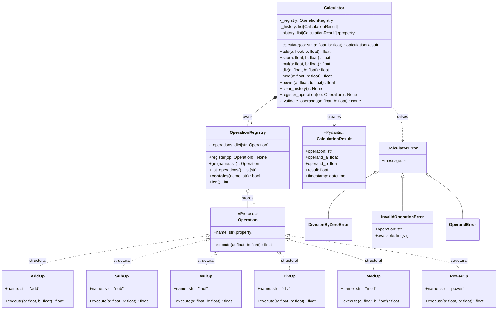
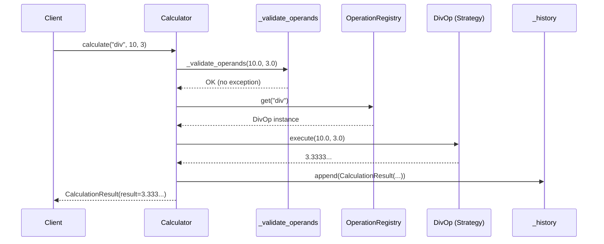
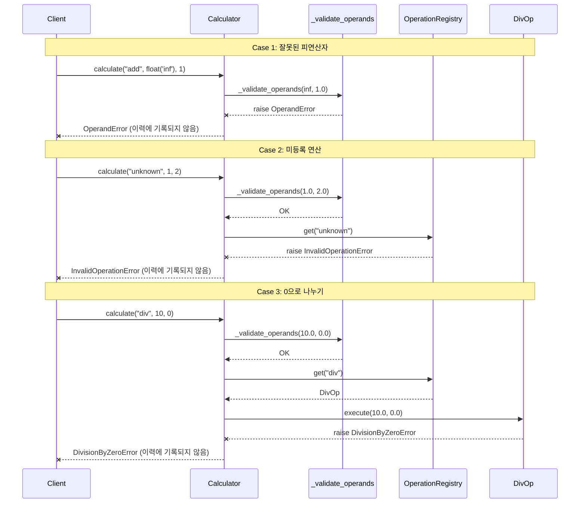
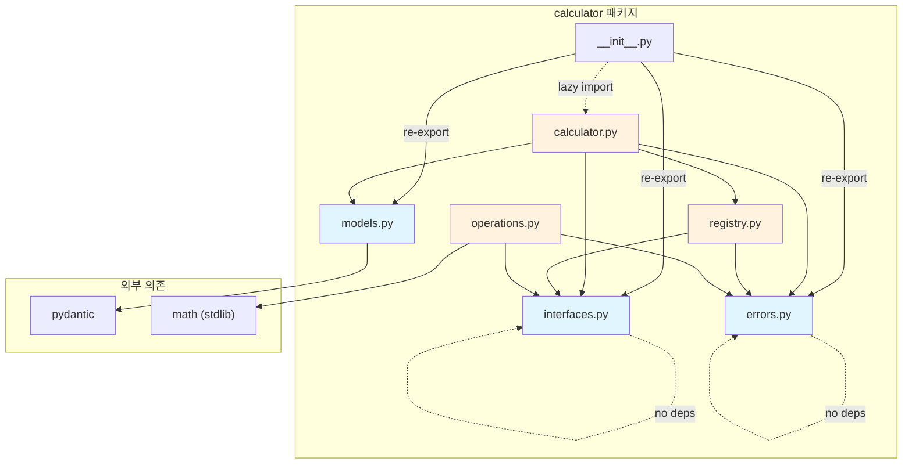
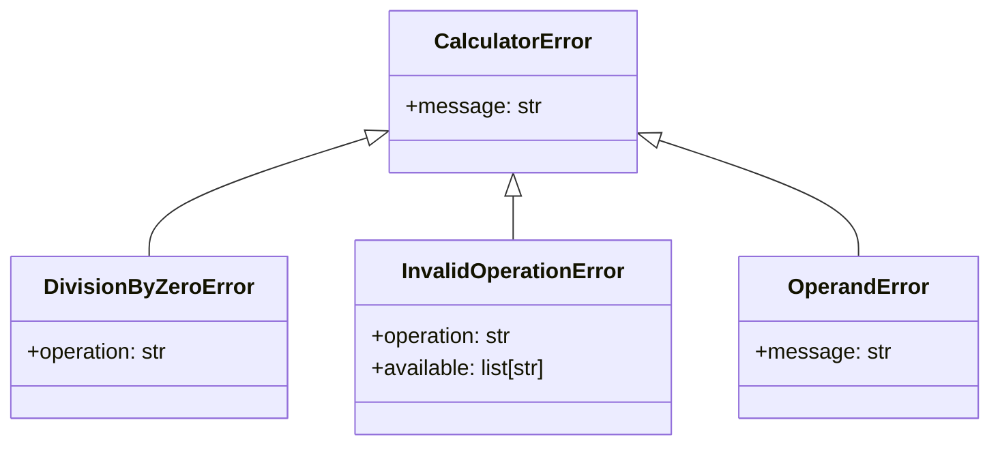

# Calculator Library — 아키텍처 설계서 (v2)

> **Status**: Approved  
> **Author**: Architect  
> **Date**: 2026-04-06  
> **Scope**: `src/orchestrator/calculator/` 패키지  
> **Python**: 3.12+ / mypy strict  
> **기존 구현**: `interfaces.py`, `models.py`, `errors.py`, `__init__.py` (변경 없이 재사용)

---

## 1. 개요

범용 계산기 라이브러리. 사칙연산 + mod + power를 기본 제공하며, **Strategy + Registry 패턴**으로 사용자 정의 연산을 런타임에 확장할 수 있다.

### 1.1 설계 목표

| 목표 | 설명 | 검증 방법 |
|------|------|-----------|
| **OCP (개방-폐쇄 원칙)** | 새 연산 추가 시 기존 코드 수정 0줄 | 커스텀 연산 테스트 |
| **타입 안전성** | mypy strict 모드 0 에러 | CI mypy check |
| **테스트 용이성** | 각 연산·레지스트리·파사드 독립 테스트 | 45+ 테스트 케이스 |
| **일관된 에러 처리** | 도메인 예외 계층으로 명확한 에러 전달 | 예외 타입별 테스트 |
| **프로젝트 일관성** | 기존 Pydantic v2 / Protocol / structlog 패턴 유지 | 코드 리뷰 |

---

## 2. 디렉토리 구조 및 파일 목록

```
src/orchestrator/calculator/
├── __init__.py          # ✅ 기존 (패키지 공개 API, lazy import)
├── interfaces.py        # ✅ 기존 (Operation Protocol)
├── models.py            # ✅ 기존 (CalculationResult Pydantic 모델)
├── errors.py            # ✅ 기존 (예외 계층)
├── operations.py        # 🆕 기본 제공 연산 6종 Strategy 구현
├── registry.py          # 🆕 OperationRegistry — 연산 등록·조회·목록
└── calculator.py        # 🆕 Calculator Facade — 공개 API, 이력, 입력 검증

tests/unit/calculator/
├── __init__.py          # 🆕 테스트 패키지
├── conftest.py          # 🆕 공통 fixture
├── test_operations.py   # 🆕 각 연산 Strategy 단위 테스트
├── test_registry.py     # 🆕 Registry CRUD 테스트
└── test_calculator.py   # 🆕 Facade 통합 테스트
```

### 2.1 파일별 역할 상세

| 파일 경로 | 역할 | LoC 예상 |
|-----------|------|----------|
| `operations.py` | `AddOp`, `SubOp`, `MulOp`, `DivOp`, `ModOp`, `PowerOp` 6개 전략 클래스. 각 클래스는 `Operation` Protocol을 만족한다. | ~90 |
| `registry.py` | `OperationRegistry` 클래스. `dict[str, Operation]` 기반 등록·조회·목록 관리. thread-safe하지 않음 (단일 스레드 사용 전제). | ~50 |
| `calculator.py` | `Calculator` Facade 클래스. Registry를 소유하고, 편의 메서드(`add`, `sub`, ...), 범용 `calculate()`, 이력(`history`) 관리, 입력 검증(`_validate_operands`)을 담당한다. | ~120 |
| `conftest.py` | `calculator` fixture (기본 연산 등록된 인스턴스), `empty_calculator` fixture, 커스텀 연산 fixture | ~30 |
| `test_operations.py` | 6개 연산 × 정상·경계·에러 = ~24 케이스 | ~150 |
| `test_registry.py` | 등록, 조회, 목록, 중복, 미등록 = ~8 케이스 | ~60 |
| `test_calculator.py` | 편의 메서드, calculate, 이력, 에러, 확장 = ~15 케이스 | ~120 |

---

## 3. 아키텍처

### 3.1 레이어 구조

```
┌─────────────────────────────────────────────────┐
│          Public API (Facade Layer)               │
│   Calculator 클래스 — 편의 메서드 + calculate()    │
│   입력 검증, 이력 기록, 연산 위임                    │
├─────────────────────────────────────────────────┤
│          Registry Layer                          │
│   OperationRegistry — 전략 객체 등록·조회·목록      │
├─────────────────────────────────────────────────┤
│          Strategy Layer                          │
│   AddOp · SubOp · MulOp · DivOp · ModOp · PowerOp│
│   각각 Operation Protocol 만족                    │
├─────────────────────────────────────────────────┤
│          Foundation Layer                         │
│   Operation (Protocol) · CalculationResult (Model)│
│   CalculatorError 예외 계층                       │
└─────────────────────────────────────────────────┘
```

### 3.2 컴포넌트 다이어그램



### 3.3 시퀀스 다이어그램 — 정상 흐름



### 3.4 시퀀스 다이어그램 — 에러 흐름



---

## 4. 모듈 간 의존 관계



**의존 방향 원칙**: Foundation Layer(`interfaces`, `models`, `errors`)는 외부 의존이 없거나 최소(pydantic)이며, 상위 레이어만 하위를 참조한다. 순환 의존 없음.

---

## 5. 인터페이스 정의 (시그니처)

### 5.1 `operations.py` — 6개 연산 Strategy

> 기존 `interfaces.py`의 `Operation` Protocol을 구조적으로 만족하는 클래스들.
> 명시적 상속 없이 `name` 프로퍼티와 `execute` 메서드만 구현한다.

```python
# src/orchestrator/calculator/operations.py
"""기본 제공 이항 연산 Strategy 구현체.

각 클래스는 Operation Protocol을 구조적(structural)으로 만족한다.
새 연산 추가 시 이 파일에 클래스를 추가하거나,
별도 모듈에 독립적으로 구현해도 된다.
"""
from __future__ import annotations

import math

from orchestrator.calculator.errors import DivisionByZeroError


class AddOp:
    """덧셈 연산."""

    @property
    def name(self) -> str:
        return "add"

    def execute(self, a: float, b: float) -> float:
        """a + b를 반환한다."""
        ...


class SubOp:
    """뺄셈 연산."""

    @property
    def name(self) -> str:
        return "sub"

    def execute(self, a: float, b: float) -> float:
        """a - b를 반환한다."""
        ...


class MulOp:
    """곱셈 연산."""

    @property
    def name(self) -> str:
        return "mul"

    def execute(self, a: float, b: float) -> float:
        """a * b를 반환한다."""
        ...


class DivOp:
    """나눗셈 연산.

    Raises:
        DivisionByZeroError: b가 0인 경우.
    """

    @property
    def name(self) -> str:
        return "div"

    def execute(self, a: float, b: float) -> float:
        """a / b를 반환한다. b == 0이면 DivisionByZeroError."""
        ...


class ModOp:
    """나머지 연산.

    Raises:
        DivisionByZeroError: b가 0인 경우.
    """

    @property
    def name(self) -> str:
        return "mod"

    def execute(self, a: float, b: float) -> float:
        """a % b를 반환한다. b == 0이면 DivisionByZeroError."""
        ...


class PowerOp:
    """거듭제곱 연산.

    math.pow를 사용하여 일관된 float 반환을 보장한다.
    """

    @property
    def name(self) -> str:
        return "power"

    def execute(self, a: float, b: float) -> float:
        """a ** b를 반환한다."""
        ...


# 편의: 기본 연산 인스턴스 목록 (Registry 초기화에 사용)
DEFAULT_OPERATIONS: list = [AddOp(), SubOp(), MulOp(), DivOp(), ModOp(), PowerOp()]
"""Calculator() 생성 시 자동 등록할 기본 연산 인스턴스 리스트."""
```

**설계 결정 — `@property` vs 클래스 변수 `name`**:

| 기준 | `@property` ✅ | 클래스 변수 `name = "add"` |
|------|----------------|---------------------------|
| Protocol 호환 | `Operation.name`이 property로 정의됨 → 완벽 호환 | mypy strict에서 Protocol property와 불일치 경고 가능 |
| 불변성 | 읽기 전용 보장 | 외부에서 덮어쓰기 가능 |
| 일관성 | 기존 `interfaces.py`의 정의와 동일 패턴 | — |

**결정**: `@property`로 통일. mypy strict 모드에서 Protocol의 `@property`와 구현체의 클래스 변수 간 불일치를 방지한다.

**설계 결정 — `math.pow` vs `**` 연산자 (PowerOp)**:

| 기준 | `math.pow` ✅ | `**` 연산자 |
|------|--------------|-------------|
| 반환 타입 | 항상 `float` | `int ** int → int` (타입 불일치 가능) |
| 오버플로 | `OverflowError` 발생 | `OverflowError` 또는 `inf` |
| 일관성 | 모든 연산이 `float` 반환 | 타입 혼재 |

**결정**: `math.pow` 사용. 모든 연산의 반환 타입이 `float`으로 통일된다.

---

### 5.2 `registry.py` — OperationRegistry

```python
# src/orchestrator/calculator/registry.py
"""연산 전략 객체의 등록·조회·관리를 담당하는 Registry.

Thread-safety: 보장하지 않는다. 단일 스레드 또는 초기화 시점에서만
연산을 등록하고, 이후에는 읽기만 수행하는 패턴을 전제한다.
"""
from __future__ import annotations

from orchestrator.calculator.errors import InvalidOperationError
from orchestrator.calculator.interfaces import Operation


class OperationRegistry:
    """연산 전략 객체를 name → Operation 매핑으로 관리한다.

    Attributes:
        _operations: 등록된 연산의 내부 딕셔너리.
    """

    def __init__(self) -> None:
        """빈 레지스트리를 생성한다."""
        ...

    def register(self, op: Operation) -> None:
        """연산을 등록한다.

        동일한 name의 연산이 이미 존재하면 덮어쓴다 (upsert 시맨틱).
        이는 테스트 시 mock 연산으로 교체하거나,
        기본 연산을 커스텀 구현으로 오버라이드할 때 유용하다.

        Args:
            op: Operation Protocol을 만족하는 객체.

        Raises:
            TypeError: op가 Operation Protocol을 만족하지 않는 경우.
        """
        ...

    def get(self, name: str) -> Operation:
        """이름으로 연산을 조회한다.

        Args:
            name: 연산 식별자 (예: "add", "div").

        Returns:
            등록된 Operation 인스턴스.

        Raises:
            InvalidOperationError: name에 해당하는 연산이 없는 경우.
                available 필드에 등록된 연산 목록을 포함한다.
        """
        ...

    def list_operations(self) -> list[str]:
        """등록된 모든 연산 이름을 정렬된 리스트로 반환한다.

        Returns:
            연산 이름 리스트 (알파벳 순 정렬).
        """
        ...

    def __contains__(self, name: str) -> bool:
        """'name' in registry 구문을 지원한다.

        Args:
            name: 확인할 연산 이름.

        Returns:
            연산 등록 여부.
        """
        ...

    def __len__(self) -> int:
        """등록된 연산 수를 반환한다."""
        ...
```

**설계 결정 — 중복 등록 시 upsert vs 예외**:

| 기준 | Upsert (덮어쓰기) ✅ | 예외 발생 |
|------|---------------------|----------|
| 유연성 | 테스트 시 mock 교체 용이 | 명시적 unregister 필요 |
| 안전성 | 실수로 기존 연산 덮어쓸 위험 | 실수 방지 |
| 실용성 | 초기화 순서 무관 | 순서 의존성 발생 |

**결정**: Upsert 채택. 테스트와 확장 시 편의성이 더 중요하며, `list_operations()`로 현재 상태를 확인할 수 있다.

**설계 결정 — `register()`에 Protocol 런타임 검증 포함 여부**:

| 기준 | 런타임 검증 ✅ | 검증 없음 |
|------|--------------|----------|
| 안전성 | 잘못된 객체 조기 발견 | execute 시점에 AttributeError |
| 오류 메시지 | 명확한 TypeError | 난해한 AttributeError |
| 성능 | `isinstance` 체크 오버헤드 (무시 가능) | — |

**결정**: `runtime_checkable` Protocol + `isinstance` 체크 수행. 잘못된 객체를 등록 시점에서 차단한다.

---

### 5.3 `calculator.py` — Calculator Facade

```python
# src/orchestrator/calculator/calculator.py
"""Calculator Facade — 계산기 라이브러리의 유일한 공개 진입점.

사용자는 이 클래스만으로 모든 계산, 이력 조회, 연산 확장을 수행한다.
내부적으로 OperationRegistry에 연산 조회를 위임하고,
결과를 CalculationResult로 래핑하여 이력에 기록한다.
"""
from __future__ import annotations

import math

from orchestrator.calculator.errors import OperandError
from orchestrator.calculator.interfaces import Operation
from orchestrator.calculator.models import CalculationResult
from orchestrator.calculator.operations import DEFAULT_OPERATIONS
from orchestrator.calculator.registry import OperationRegistry


class Calculator:
    """확장 가능한 계산기.

    생성 시 6개 기본 연산(add, sub, mul, div, mod, power)이 자동 등록된다.
    `register_operation()`으로 커스텀 연산을 추가할 수 있다.

    Attributes:
        _registry: 연산 전략 레지스트리.
        _history: 수행된 계산 이력 (시간순).

    Example:
        >>> calc = Calculator()
        >>> calc.add(3, 5)
        8.0
        >>> calc.calculate("mul", 4, 5).result
        20.0
        >>> len(calc.history)
        2
    """

    def __init__(self) -> None:
        """기본 연산이 등록된 Calculator를 생성한다."""
        ...

    # ── 범용 계산 ───────────────────────────────────────

    def calculate(self, op: str, a: float, b: float) -> CalculationResult:
        """지정된 연산을 수행하고 결과를 이력에 기록한다.

        실행 순서:
        1. _validate_operands(a, b) — inf/nan 검증
        2. _registry.get(op) — 연산 조회 (없으면 InvalidOperationError)
        3. operation.execute(a, b) — 연산 수행 (에러 시 전파)
        4. CalculationResult 생성 → _history에 추가
        5. CalculationResult 반환

        에러 발생 시(1~3단계) 이력에 기록되지 않는다.

        Args:
            op: 연산 이름 (예: "add", "div", "power").
            a: 첫 번째 피연산자.
            b: 두 번째 피연산자.

        Returns:
            CalculationResult: 연산 결과를 포함한 불변 모델.

        Raises:
            OperandError: a 또는 b가 inf/nan인 경우.
            InvalidOperationError: 미등록 연산 이름.
            DivisionByZeroError: 0으로 나누기 시도.
            CalculatorError: 기타 연산 수행 실패.
        """
        ...

    # ── 편의 메서드 (Shorthand) ─────────────────────────

    def add(self, a: float, b: float) -> float:
        """a + b. 내부적으로 calculate("add", a, b)를 호출한다.

        Returns:
            연산 결과값 (CalculationResult.result).
        """
        ...

    def sub(self, a: float, b: float) -> float:
        """a - b. 내부적으로 calculate("sub", a, b)를 호출한다."""
        ...

    def mul(self, a: float, b: float) -> float:
        """a * b. 내부적으로 calculate("mul", a, b)를 호출한다."""
        ...

    def div(self, a: float, b: float) -> float:
        """a / b. 내부적으로 calculate("div", a, b)를 호출한다.

        Raises:
            DivisionByZeroError: b == 0인 경우.
        """
        ...

    def mod(self, a: float, b: float) -> float:
        """a % b. 내부적으로 calculate("mod", a, b)를 호출한다.

        Raises:
            DivisionByZeroError: b == 0인 경우.
        """
        ...

    def power(self, a: float, b: float) -> float:
        """a ** b. 내부적으로 calculate("power", a, b)를 호출한다."""
        ...

    # ── 이력 관리 ───────────────────────────────────────

    @property
    def history(self) -> list[CalculationResult]:
        """수행된 계산 이력의 복사본을 반환한다.

        원본 리스트의 변조를 방지하기 위해 shallow copy를 반환한다.
        CalculationResult 자체는 frozen=True이므로 내부 항목도 불변이다.

        Returns:
            CalculationResult 리스트 (시간순, 오래된 것이 앞).
        """
        ...

    def clear_history(self) -> None:
        """이력을 모두 삭제한다."""
        ...

    # ── 연산 확장 ───────────────────────────────────────

    def register_operation(self, op: Operation) -> None:
        """커스텀 연산을 등록한다. Registry.register()에 위임.

        Args:
            op: Operation Protocol을 만족하는 객체.

        Raises:
            TypeError: op가 Operation Protocol을 만족하지 않는 경우.
        """
        ...

    # ── 내부 헬퍼 ───────────────────────────────────────

    def _validate_operands(self, a: float, b: float) -> None:
        """피연산자가 유한한 실수인지 검증한다.

        math.isfinite()를 사용하여 inf와 nan을 모두 거부한다.

        Args:
            a: 첫 번째 피연산자.
            b: 두 번째 피연산자.

        Raises:
            OperandError: a 또는 b가 inf 또는 nan인 경우.
        """
        ...
```

**설계 결정 — 편의 메서드 vs `calculate()` only**:

| 기준 | 편의 메서드 제공 ✅ | `calculate()` only |
|------|--------------------|--------------------|
| DX (개발자 경험) | `calc.add(3, 5)` — 직관적 | `calc.calculate("add", 3, 5).result` — 번거로움 |
| API 표면 | 넓음 (7개 메서드) | 좁음 (1개 메서드) |
| 타입 안전성 | 메서드별 명확한 시그니처 | 문자열 기반 (오타 위험) |
| 커스텀 연산 | `calculate()`로만 호출 가능 | 동일 |

**결정**: 기본 6개 연산에 대해서만 편의 메서드 제공. 커스텀 연산은 `calculate()`로 호출. DX와 타입 안전성의 균형.

**설계 결정 — `history` property가 복사본을 반환하는 이유**:

| 기준 | 복사본 반환 ✅ | 원본 참조 반환 |
|------|--------------|---------------|
| 캡슐화 | 외부에서 `history.clear()` 등으로 내부 상태 변조 불가 | 변조 가능 |
| 메모리 | shallow copy 오버헤드 (무시 가능) | — |
| 일관성 | `clear_history()`만이 삭제의 유일한 경로 | 다중 경로 |

**결정**: `list(self._history)` shallow copy 반환. `CalculationResult`가 `frozen=True`이므로 deep copy 불필요.

**설계 결정 — 입력 검증 위치: Calculator vs Operation**:

| 기준 | Calculator에서 검증 ✅ | 각 Operation에서 검증 |
|------|----------------------|--------------------|
| 중복 제거 | 한 곳에서 inf/nan 검증 | 6곳에서 동일 검증 반복 |
| 책임 분리 | Calculator = 검증 + 조정, Operation = 순수 연산 | Operation에 검증 로직 혼재 |
| 예외 | 0나누기는 Operation에서 (도메인 로직), inf/nan은 Calculator에서 (입력 검증) | — |

**결정**: **이중 검증 전략** 채택.
- `Calculator._validate_operands()`: inf/nan 등 범용 입력 검증
- `DivOp.execute()` / `ModOp.execute()`: 0으로 나누기 (도메인 특화 검증)

---

## 6. 에러 처리 전략

### 6.1 예외 계층 (기존 `errors.py` — 변경 없음)



### 6.2 예외 발생 지점 매핑

| 예외 | 발생 위치 | 발생 조건 | 이력 기록 |
|------|----------|----------|----------|
| `OperandError` | `Calculator._validate_operands()` | `math.isfinite(a)` 또는 `math.isfinite(b)` 실패 | ❌ |
| `InvalidOperationError` | `OperationRegistry.get()` | 미등록 연산 이름 | ❌ |
| `DivisionByZeroError` | `DivOp.execute()`, `ModOp.execute()` | `b == 0` | ❌ |
| `TypeError` | `OperationRegistry.register()` | Protocol 불만족 객체 등록 시도 | N/A |

**원칙**: 에러 발생 시 이력에 기록하지 않는다. 성공한 연산만 이력에 남긴다.

---

## 7. 테스트 전략

### 7.1 `conftest.py` — 공통 Fixture

```python
# tests/unit/calculator/conftest.py

@pytest.fixture
def calculator() -> Calculator:
    """기본 6개 연산이 등록된 Calculator 인스턴스."""
    ...

@pytest.fixture
def empty_registry() -> OperationRegistry:
    """빈 OperationRegistry."""
    ...

@pytest.fixture
def custom_op() -> MaxOperation:
    """커스텀 연산 (테스트용 max 연산)."""
    ...
```

### 7.2 테스트 매트릭스

#### `test_operations.py` — 연산 단위 테스트

| 연산 | 정상 케이스 | 경계 케이스 | 에러 케이스 |
|------|-----------|-----------|-----------|
| `AddOp` | `add(3, 5) → 8.0` | `add(0, 0) → 0.0`, 음수 | — |
| `SubOp` | `sub(10, 3) → 7.0` | `sub(0, 0) → 0.0`, 음수 | — |
| `MulOp` | `mul(4, 5) → 20.0` | `mul(0, x) → 0.0`, 음수 | — |
| `DivOp` | `div(10, 3) → 3.33..` | `div(0, 5) → 0.0` | `div(x, 0) → DivisionByZeroError` |
| `ModOp` | `mod(10, 3) → 1.0` | `mod(0, 5) → 0.0` | `mod(x, 0) → DivisionByZeroError` |
| `PowerOp` | `power(2, 10) → 1024.0` | `power(x, 0) → 1.0` | — |

#### `test_registry.py` — Registry 테스트

| 케이스 | 설명 |
|--------|------|
| `test_register_and_get` | 정상 등록 후 조회 |
| `test_get_unregistered` | 미등록 연산 → `InvalidOperationError` |
| `test_list_operations` | 등록된 이름 목록 (정렬) |
| `test_upsert_overwrite` | 동일 이름 재등록 시 덮어쓰기 |
| `test_contains` | `"add" in registry` → True |
| `test_len` | `len(registry)` == 등록 수 |
| `test_register_invalid_object` | Protocol 불만족 → `TypeError` |
| `test_register_protocol_check` | `isinstance(op, Operation)` → True |

#### `test_calculator.py` — Facade 통합 테스트

| 케이스 | 설명 |
|--------|------|
| `test_add/sub/mul/div/mod/power` | 편의 메서드 정상 동작 (6개) |
| `test_calculate_returns_result` | `calculate()` → `CalculationResult` 타입 |
| `test_history_records` | 연산 수행 후 `history` 길이 증가 |
| `test_history_is_copy` | `history` 수정해도 내부 상태 무변경 |
| `test_clear_history` | `clear_history()` 후 `history` 비어있음 |
| `test_operand_inf` | `calculate("add", inf, 1)` → `OperandError` |
| `test_operand_nan` | `calculate("add", nan, 1)` → `OperandError` |
| `test_division_by_zero` | `div(1, 0)` → `DivisionByZeroError` |
| `test_invalid_operation` | `calculate("unknown", 1, 2)` → `InvalidOperationError` |
| `test_register_custom_op` | 커스텀 연산 등록 후 `calculate()` 성공 |
| `test_error_not_in_history` | 에러 발생 시 이력 미기록 |

**총 예상: ~47 테스트 케이스**

---

## 8. 사용 예시 (Target API)

```python
from orchestrator.calculator import Calculator, Operation

# ── 기본 사용 ──────────────────────────────
calc = Calculator()

calc.add(3, 5)          # → 8.0
calc.sub(10, 3)         # → 7.0
calc.mul(4, 5)          # → 20.0
calc.div(10, 3)         # → 3.3333333333333335
calc.mod(10, 3)         # → 1.0
calc.power(2, 10)       # → 1024.0

# ── 범용 calculate() ──────────────────────
result = calc.calculate("mul", 4, 5)
result.result       # 20.0
result.operation    # "mul"
result.operand_a    # 4.0
result.operand_b    # 5.0
result.timestamp    # datetime(...)

# ── 이력 조회 ─────────────────────────────
calc.history        # [CalculationResult(...), ...]
len(calc.history)   # 7 (위에서 7번 연산)
calc.clear_history()
len(calc.history)   # 0

# ── 에러 처리 ─────────────────────────────
from orchestrator.calculator import (
    CalculatorError,
    DivisionByZeroError,
    InvalidOperationError,
    OperandError,
)

try:
    calc.div(10, 0)
except DivisionByZeroError as e:
    print(e.message)     # "0으로 나눌 수 없습니다 (operation: div)"

try:
    calc.calculate("sqrt", 4, 0)
except InvalidOperationError as e:
    print(e.available)   # ["add", "div", "mod", "mul", "power", "sub"]

# ── 커스텀 연산 확장 ──────────────────────
class MaxOperation:
    """Operation Protocol을 만족하는 커스텀 연산."""

    @property
    def name(self) -> str:
        return "max"

    def execute(self, a: float, b: float) -> float:
        return max(a, b)

calc.register_operation(MaxOperation())
calc.calculate("max", 42, 17).result  # 42.0
```

---

## 9. 향후 확장 포인트

| 확장 | 영향 범위 | 난이도 |
|------|----------|--------|
| **수식 파서** (`calc.evaluate("3 + 5 * 2")`) | 새 모듈 `parser.py` 추가, `Calculator`에 `evaluate()` 메서드 추가 | 중 |
| **단항 연산** (`sqrt`, `abs`, `factorial`) | `UnaryOperation` Protocol 추가, Registry에 다형적 저장 | 중 |
| **EventBus 연동** | `Calculator`에 옵저버 훅 추가 → `core/events/bus.py` 연동 | 저 |
| **REST API** | `api/routes.py`에 `/calculator` 엔드포인트 추가 | 저 |
| **정밀 연산** (`decimal.Decimal`) | `Operation.execute` 제네릭화 또는 별도 `PreciseCalculator` | 고 |
| **비동기 연산** | `AsyncOperation` Protocol, `async execute()` | 중 |

---

## 10. 체크리스트 (구현자용)

- [ ] `operations.py` — 6개 연산 클래스 구현
- [ ] `registry.py` — `OperationRegistry` 구현
- [ ] `calculator.py` — `Calculator` Facade 구현
- [ ] `tests/unit/calculator/conftest.py` — fixture 작성
- [ ] `tests/unit/calculator/test_operations.py` — 연산 단위 테스트
- [ ] `tests/unit/calculator/test_registry.py` — Registry 테스트
- [ ] `tests/unit/calculator/test_calculator.py` — Facade 통합 테스트
- [ ] `mypy --strict` 통과 확인
- [ ] `ruff check` / `ruff format` 통과 확인
- [ ] 전체 테스트 `pytest tests/unit/calculator/ -v` 통과 확인
