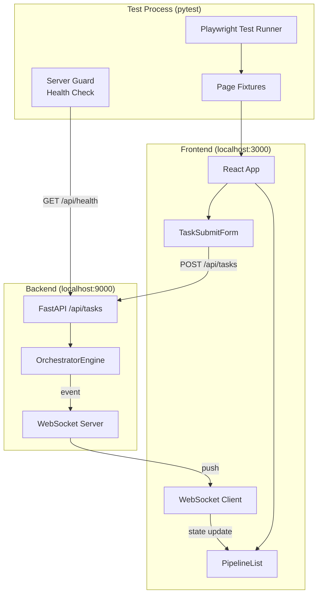
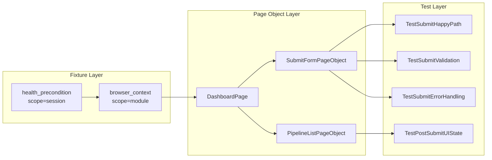
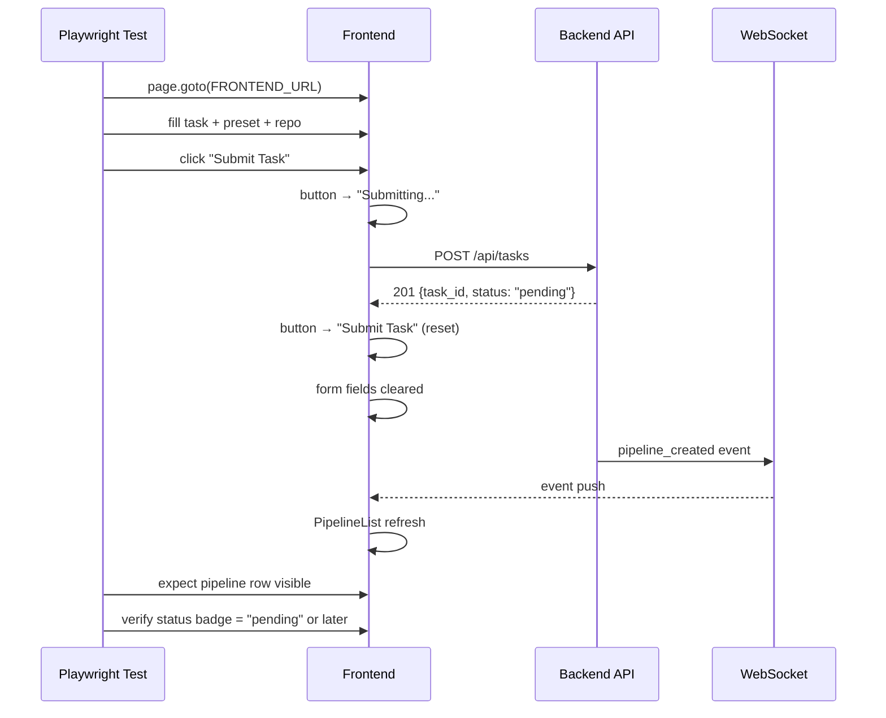

# 설계 문서: Playwright E2E 제출 테스트

> **작성자**: 시니어 아키텍트  
> **작성일**: 2026-04-06  
> **상태**: Draft  
> **대상 파일**: `tests/e2e/test_playwright_e2e.py`

---

## 1. 목적 및 범위

### 1.1 목적

사용자가 **프론트엔드 UI**를 통해 태스크를 제출하면, 백엔드 파이프라인이 생성되고 UI에 결과가 반영되는 전체 흐름을 Playwright로 검증한다. 현재 `TestTaskSubmitForm.test_submit_task_creates_pipeline`은 **제출 후 2초 하드코딩 대기 + 조건부 assert** 패턴으로, 실질적으로 제출 성공을 보장하지 못하는 불안정한 테스트이다.

### 1.2 현황 분석

| 항목 | 현재 상태 | 문제점 |
|------|-----------|--------|
| 제출 테스트 | `wait_for_timeout(2000)` 후 `pipeline_table.count() > 0`이면 체크 | **false positive** — 테이블이 없으면 assert skip됨 |
| 백엔드 연동 | 실제 서버(`localhost:9000`) 필요 | **사전 조건 미검증**, 서버 없으면 silent fail |
| 에러 경로 | 미테스트 | 빈 태스크 제출, 서버 다운 시 에러 표시 미검증 |
| 제출 후 상태 | 미검증 | 폼 초기화, 버튼 상태 변화 미확인 |
| 파이프라인 상세 | 미테스트 | 제출 후 파이프라인 클릭 → 상세/서브태스크 표시 미검증 |

### 1.3 범위

```
✅ In Scope:
  - 태스크 제출 → 파이프라인 생성 → UI 반영 전체 흐름
  - 제출 폼 상태 전이 (입력 → 제출 중 → 초기화)
  - 에러 케이스 (빈 입력, 서버 에러, 네트워크 오류)
  - 파이프라인 목록 업데이트 확인
  - WebSocket 이벤트 수신 확인

❌ Out of Scope:
  - 파이프라인 실행 완료 대기 (별도 테스트)
  - 백엔드 비즈니스 로직 검증 (기존 unit/integration 테스트 영역)
  - 크로스 브라우저 테스트 (Chromium만)
```

---

## 2. 아키텍처

### 2.1 테스트 인프라 구성



### 2.2 테스트 계층 및 의존성



---

## 3. 설계 결정 및 Trade-off 분석

### 3.1 Page Object Pattern 도입 여부

| 선택지 | 장점 | 단점 |
|--------|------|------|
| **A. Page Object 도입** | 셀렉터 중앙 관리, 테스트 가독성 향상, 재사용성 | 초기 보일러플레이트, 파일 수 증가 |
| B. 인라인 셀렉터 유지 | 단순성, 빠른 작성 | 셀렉터 중복, 변경 시 N곳 수정 |

**결정: A (Page Object)** — 현재 `test_playwright_e2e.py`에 이미 셀렉터 중복이 5회 이상. 단, 현재 규모에서 별도 파일 분리는 과도하므로 **같은 파일 내 클래스**로 정의한다.

### 3.2 서버 사전 조건 처리

| 선택지 | 장점 | 단점 |
|--------|------|------|
| **A. session-scoped fixture로 health check** | 서버 없을 때 즉시 skip, 명확한 에러 메시지 | fixture 추가 |
| B. 각 테스트에서 try/except | 개별 제어 가능 | 보일러플레이트, 일관성 저하 |
| C. conftest에서 subprocess로 서버 기동 | 완전 자동화 | 복잡성 증가, 포트 충돌 리스크, 서버 기동 시간 |

**결정: A** — MVP 단계에서 서버를 테스트가 관리하는 것은 과도. `pytest.skip`으로 명확하게 처리한다.

### 3.3 비동기 대기 전략

| 선택지 | 장점 | 단점 |
|--------|------|------|
| A. `wait_for_timeout` (현재) | 단순 | **Flaky** — 네트워크 지연 시 실패, 빠를 때 불필요한 대기 |
| **B. `expect()` + `wait_for_selector`** | 이벤트 기반, deterministic | Playwright API 이해 필요 |
| C. Polling loop | 세밀한 제어 | 직접 구현 복잡도 |

**결정: B** — Playwright의 auto-retry/auto-wait 메커니즘 활용. `expect().to_be_visible(timeout=5000)` 등을 사용하여 flaky 테스트를 제거한다.

### 3.4 API 인터셉트 방식

| 선택지 | 장점 | 단점 |
|--------|------|------|
| **A. `page.route()`로 네트워크 인터셉트** | 서버 독립적 에러 테스트, 응답 커스터마이즈 가능 | mock 범위 관리 필요 |
| B. 실제 서버에 의존 | 진짜 통합 테스트 | 에러 케이스 재현 어려움 |

**결정: A (에러 테스트에서만)** — Happy path는 실서버 연동, 에러 테스트(`TestSubmitErrorHandling`)에서만 `page.route()`를 사용하여 500/네트워크 에러를 시뮬레이션한다.

---

## 4. 인터페이스 정의

### 4.1 Page Object: `SubmitFormPO`

```python
class SubmitFormPO:
    """TaskSubmitForm 컴포넌트의 Page Object.
    
    셀렉터를 캡슐화하고 사용자 액션을 메서드로 추상화한다.
    """

    # ── Selectors ──
    TASK_INPUT = "#task-input"
    PRESET_INPUT = "#preset-input"
    REPO_INPUT = "#repo-input"
    SUBMIT_BTN = "button:has-text('Submit Task')"
    SUBMITTING_BTN = "button:has-text('Submitting...')"
    ERROR_MSG = ".submit-form >> [style*='accent-red']"
    FORM_HEADER = ".panel-header:has-text('Submit Task')"

    def __init__(self, page: Page) -> None: ...

    # ── Query Methods ──
    def is_visible(self) -> None:
        """폼 패널이 표시되는지 확인한다 (expect 기반)."""
        ...

    def is_submit_enabled(self) -> bool:
        """Submit 버튼 활성화 여부를 반환한다."""
        ...

    def get_error_text(self) -> str | None:
        """에러 메시지 텍스트를 반환한다 (없으면 None)."""
        ...

    def get_task_value(self) -> str:
        """태스크 입력 필드의 현재 값을 반환한다."""
        ...

    # ── Action Methods ──
    def fill_task(self, text: str) -> None:
        """태스크 입력 필드에 텍스트를 입력한다."""
        ...

    def fill_preset(self, preset: str) -> None:
        """프리셋 입력 필드에 텍스트를 입력한다."""
        ...

    def fill_repo(self, repo: str) -> None:
        """레포 입력 필드에 텍스트를 입력한다."""
        ...

    def submit(self) -> None:
        """Submit 버튼을 클릭한다."""
        ...

    def submit_task(
        self,
        task: str,
        preset: str = "",
        repo: str = "",
    ) -> None:
        """태스크를 채우고 제출하는 편의 메서드."""
        ...

    # ── Wait Methods ──
    def wait_for_submit_complete(self, timeout: int = 5000) -> None:
        """제출 완료(버튼이 'Submit Task'로 복귀)까지 대기한다."""
        ...
```

### 4.2 Page Object: `PipelineListPO`

```python
class PipelineListPO:
    """PipelineList 컴포넌트의 Page Object."""

    # ── Selectors ──
    PANEL = ".pipeline-list"
    TABLE = ".pipeline-table"
    TABLE_ROWS = ".pipeline-table tbody tr"
    EMPTY_STATE = ".empty-state"
    PANEL_HEADER = ".panel-header:has-text('Pipelines')"

    def __init__(self, page: Page) -> None: ...

    # ── Query Methods ──
    def get_row_count(self) -> int:
        """파이프라인 테이블 행 수를 반환한다."""
        ...

    def has_pipeline_with_text(self, text: str) -> bool:
        """특정 텍스트를 포함한 파이프라인 행이 있는지 확인한다."""
        ...

    def is_empty(self) -> bool:
        """빈 상태 메시지가 표시되는지 확인한다."""
        ...

    def get_pipeline_status(self, row_index: int) -> str:
        """특정 행의 파이프라인 상태 배지 텍스트를 반환한다."""
        ...

    # ── Action Methods ──
    def click_pipeline(self, row_index: int) -> None:
        """특정 행의 파이프라인을 클릭한다."""
        ...

    # ── Wait Methods ──
    def wait_for_pipeline_appear(
        self,
        text: str | None = None,
        timeout: int = 5000,
    ) -> None:
        """파이프라인이 목록에 나타날 때까지 대기한다.
        
        text가 주어지면 해당 텍스트를 포함하는 행이 나타날 때까지 대기.
        없으면 아무 행이든 나타나면 통과.
        """
        ...

    def wait_for_status(
        self,
        row_index: int,
        status: str,
        timeout: int = 10000,
    ) -> None:
        """특정 파이프라인의 상태가 변경될 때까지 대기한다."""
        ...
```

### 4.3 Fixture: `server_health_guard`

```python
@pytest.fixture(scope="session")
def server_health_guard() -> None:
    """백엔드 + 프론트엔드 서버가 실행 중인지 확인한다.
    
    어느 한쪽이라도 응답하지 않으면 전체 테스트 모듈을 skip한다.
    
    체크 대상:
      - GET http://localhost:9000/api/health → {"status": "ok"}
      - GET http://localhost:3000 → 200 OK
    
    Timeout: 각 3초
    """
    ...
```

### 4.4 Fixture: `api_intercept`

```python
@pytest.fixture
def api_intercept(page: Page):
    """Playwright page.route()를 통한 API 응답 인터셉트 헬퍼.
    
    Usage:
        def test_server_error(page, api_intercept):
            api_intercept.mock_submit_error(500, "Internal Server Error")
            # ... 제출 시도 → 에러 메시지 확인
    
    Returns:
        APIInterceptHelper 인스턴스
    """
    ...


class APIInterceptHelper:
    """API 응답을 인터셉트하여 에러를 시뮬레이션한다."""

    def __init__(self, page: Page) -> None: ...

    def mock_submit_error(self, status: int, body: str) -> None:
        """POST /api/tasks 응답을 에러로 대체한다."""
        ...

    def mock_submit_success(self, pipeline_data: dict) -> None:
        """POST /api/tasks 응답을 성공 데이터로 대체한다."""
        ...

    def mock_network_error(self) -> None:
        """POST /api/tasks 요청을 네트워크 에러로 abort한다."""
        ...

    def clear(self) -> None:
        """모든 인터셉트를 해제한다."""
        ...
```

---

## 5. 테스트 시나리오 설계

### 5.1 Happy Path: `TestSubmitHappyPath`



| 테스트 ID | 시나리오 | 검증 포인트 |
|-----------|----------|-------------|
| `test_submit_with_all_fields` | task + preset + repo 입력 후 제출 | 201 응답, 폼 초기화, 파이프라인 목록 갱신 |
| `test_submit_task_only` | task만 입력 후 제출 | preset/repo 없이도 제출 성공 |
| `test_submit_clears_form` | 제출 후 폼 상태 확인 | task/preset/repo 모두 빈 문자열로 초기화 |
| `test_submit_button_state_transition` | 버튼 텍스트 변화 추적 | "Submit Task" → "Submitting..." → "Submit Task" |
| `test_pipeline_appears_in_list` | 제출 후 목록 확인 | PipelineList에 새 행 추가, 태스크 텍스트 포함 |

### 5.2 Validation: `TestSubmitValidation`

| 테스트 ID | 시나리오 | 검증 포인트 |
|-----------|----------|-------------|
| `test_empty_task_button_disabled` | 빈 입력 상태 | Submit 버튼 disabled |
| `test_whitespace_only_button_disabled` | 공백만 입력 | Submit 버튼 disabled (trim 처리) |
| `test_type_then_clear_disables_button` | 입력 후 삭제 | 버튼이 다시 disabled |

### 5.3 Error Handling: `TestSubmitErrorHandling`

| 테스트 ID | 시나리오 | 검증 포인트 |
|-----------|----------|-------------|
| `test_server_500_shows_error` | API 500 응답 mock | 에러 메시지 표시, 폼 데이터 유지 |
| `test_network_error_shows_error` | 네트워크 에러 mock | "Submit failed" 에러 표시 |
| `test_error_clears_on_retry` | 에러 후 재제출 시도 | 이전 에러 메시지 사라짐 |

### 5.4 Post-Submit UI: `TestPostSubmitUIState`

| 테스트 ID | 시나리오 | 검증 포인트 |
|-----------|----------|-------------|
| `test_multiple_submits_accumulate` | 연속 2회 제출 | 파이프라인 목록에 2행 |
| `test_websocket_event_on_submit` | 제출 후 WS 이벤트 확인 | EventLog에 pipeline_created 이벤트 표시 |

---

## 6. 생성 파일 목록

| 파일 경로 | 역할 |
|-----------|------|
| `tests/e2e/test_playwright_e2e.py` | **기존 파일 수정** — Page Object 적용, 제출 테스트 강화 |
| `tests/e2e/page_objects.py` | SubmitFormPO, PipelineListPO, DashboardPO 정의 |
| `tests/e2e/conftest_playwright.py` | Playwright 전용 fixture — `server_health_guard`, `browser_context`, `page`, `api_intercept` |

### 6.1 `tests/e2e/page_objects.py` — Page Object 클래스

- `SubmitFormPO` — §4.1 인터페이스 구현
- `PipelineListPO` — §4.2 인터페이스 구현
- `DashboardPO` — 루트 페이지 네비게이션 + 하위 PO 접근자

### 6.2 `tests/e2e/conftest_playwright.py` — Playwright fixture

- `server_health_guard` — §4.3 구현
- `browser_context` — 기존 코드 이동 + `server_health_guard` 의존성 추가
- `page` — 기존 코드 이동
- `api_intercept` — §4.4 구현

### 6.3 `tests/e2e/test_playwright_e2e.py` — 테스트 수정

- 기존 인라인 셀렉터 → Page Object 호출로 교체
- `TestTaskSubmitForm` 클래스 → `TestSubmitHappyPath` + `TestSubmitValidation` + `TestSubmitErrorHandling` + `TestPostSubmitUIState`로 분리
- `wait_for_timeout(2000)` 제거 → `expect()` + `wait_for_selector` 대체

---

## 7. 프론트엔드 테스트 가능성(Testability) 개선 제안

현재 프론트엔드에서 테스트 식별이 어려운 부분이 있다. 다음 `data-testid` 속성 추가를 권장한다:

| 컴포넌트 | 현재 셀렉터 | 권장 추가 속성 |
|----------|-------------|---------------|
| `TaskSubmitForm` error div | `[style*='accent-red']` (fragile) | `data-testid="submit-error"` |
| `PipelineList` table | `.pipeline-table` | `data-testid="pipeline-table"` |
| Pipeline row | `tbody tr` | `data-testid="pipeline-row-{task_id}"` |
| Status badge | `.status-badge` | `data-testid="status-badge"` |
| Submit button | `button:has-text(...)` | `data-testid="submit-btn"` |

> **Trade-off**: `data-testid`는 프로덕션 번들에 포함되지만, CSS 클래스 기반 셀렉터보다 스타일 변경에 robust하다. 번들 사이즈 영향은 무시할 수 있는 수준(속성당 ~20B)이므로 testability 이득이 크다.

---

## 8. 실행 방법

### 8.1 사전 조건

```bash
# 1. 백엔드 서버 실행
cd /home/yoon/repository/llm-team-orchestrator
uv run uvicorn orchestrator.api.app:app --port 9000

# 2. 프론트엔드 개발 서버 실행
cd frontend
npm run dev

# 3. Playwright 브라우저 설치 (최초 1회)
uv run playwright install chromium
```

### 8.2 테스트 실행

```bash
# Playwright E2E 테스트만 실행
uv run pytest tests/e2e/test_playwright_e2e.py -v --timeout=60 -m e2e

# 특정 테스트 클래스만 실행
uv run pytest tests/e2e/test_playwright_e2e.py::TestSubmitHappyPath -v

# headed 모드 (디버깅)
HEADED=1 uv run pytest tests/e2e/test_playwright_e2e.py -v -s
```

---

## 9. 향후 확장 고려

| 항목 | 현재 | 향후 |
|------|------|------|
| CI 통합 | 로컬 실행 | GitHub Actions에 `services:` 블록으로 백엔드/프론트엔드 자동 기동 |
| 스크린샷 증거 | 없음 | `page.screenshot()` on failure → Artifacts 업로드 |
| Visual Regression | 없음 | Playwright `toHaveScreenshot()` 으로 UI 스냅샷 비교 |
| 멀티 브라우저 | Chromium만 | `@pytest.mark.parametrize` + `["chromium", "firefox", "webkit"]` |
| 테스트 데이터 정리 | 없음 | `afterEach`에서 `DELETE /api/tasks/{id}` 호출로 생성 데이터 정리 |

---

## Appendix: 기존 코드와의 관계

```mermaid
graph TD
    subgraph "기존 E2E (Backend-only)"
        CT[tests/e2e/conftest.py<br/>MockAgentExecutor 등]
        TC[test_coding_scenario.py]
        TF[test_failure_scenario.py]
        TI[test_incident_scenario.py]
        TR[test_resume_scenario.py]
    end

    subgraph "Playwright E2E (Frontend + Backend)"
        CPW[conftest_playwright.py<br/>browser fixtures]
        PO[page_objects.py<br/>SubmitFormPO 등]
        TPW[test_playwright_e2e.py<br/>UI 테스트]
    end

    CT -.->|독립| CPW
    CPW --> TPW
    PO --> TPW
    
    style CPW fill:#2d5016,stroke:#4ade80
    style PO fill:#2d5016,stroke:#4ade80
    style TPW fill:#1e3a5f,stroke:#60a5fa
```



- `conftest.py`(기존)와 `conftest_playwright.py`(신규)는 **완전 독립** — Mock executor 기반 E2E와 Playwright UI E2E는 서로 다른 관심사
- `test_playwright_e2e.py`는 기존 파일을 **수정**하는 것이므로, 현재 `TestDashboardLoad`, `TestEventLog`, `TestAgentStatusPanel`은 유지하되 Page Object를 점진적으로 적용
